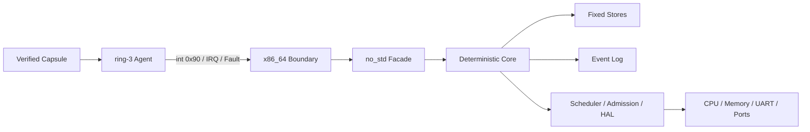

<h1 align="center">AGENT KERNEL</h1>

<p align="center">
  <code>agent-native / capability-gated / event-sourced / bare metal</code>
</p>

<p align="center">
  <strong>English</strong> · <a href="README.zh-CN.md">简体中文</a>
</p>

<p align="center">
  
  
  
  
  
</p>

```text
agent@kernel:~$ scripts/run-qemu.sh --release

[boot]      AGENT_KERNEL_QEMU_BOOT_OK
[ring-3]    AGENT_KERNEL_HETEROGENEOUS_AGENT_EXECUTION_OK
[namespace] AGENT_KERNEL_AGENT_CALL_NAMESPACE_COMPARE_REBIND_OK
[audit]     AGENT_KERNEL_NATIVE_EVENT_ARCHIVE_REPLAY_OK
[event]     396 driver_invocation_completed
[handoff]   SUPERVISOR_HANDOFF_READY
```

Agent Kernel is an agent-native operating-system kernel written in Rust.
It boots on x86_64 hardware and executes isolated ring-3 Agent Capsules.

> [!IMPORTANT]
> Active kernel development. The ABI, device coverage, and assurance model are evolving.

[`MODEL`](#01--kernel-model) · [`ARCH`](#02--architecture) ·
[`ABI`](#03--agent-call-abi) · [`PROOF`](#05--verified-profile) ·
[`BUILD`](#06--build-and-boot) · [`ROADMAP`](#08--roadmap)

## 00 / Live System

| Signal | Current reference profile |
| --- | --- |
| CPU boundary | BIOS boot, ring 0 kernel, isolated ring 3 Agents |
| State model | Fixed-capacity, deterministic, heap-free Core Stores |
| Authority | Explicit Capability scope, derivation, attenuation, revocation |
| Audit | Ordered Events, SHA-256 archive chain, exact replay |
| Recovery | Checkpoint, Rollback, fault routing, repair, restart |
| Native I/O | UART IRQ, Port I/O, immutable HAL requests, Driver invocation |

## 01 / Kernel Model

```text
AGENT --presents--> CAPABILITY --controls--> RESOURCE
  |                                      |
  +--------------- emits EVENT <--------+
```

| Primitive | Kernel contract |
| --- | --- |
| `Agent` | Authenticated authority subject with schedulable execution state |
| `Capability` | Explicit operations on one Resource; derivable and revocable |
| `Intent` | Typed declaration of desired work |
| `Task` | Schedulable unit bound to an Intent and delegated authority |
| `Verification` | Trust transition kept separate from execution completion |
| `Checkpoint` | Recovery point governed by explicit Rollback authority |
| `Event` | Deterministic evidence for each successful state mutation |
| `Namespace` | Revisioned key-to-object binding inside a Workspace |

```text
Observe | Act | Verify | Checkpoint | Rollback | Delegate
```

High authority remains explicit in Capability records and the Event chain.

## 02 / Architecture



| Layer | Owns |
| --- | --- |
| Kernel space | Identity, authority, scheduling, isolation, recovery, audit |
| User space | Planning, prompts, model runtime, policy, external adapters |
| HAL | Immutable device requests authorized before dispatch |

LLM inference stays outside kernel space. Core transitions remain bounded,
deterministic, and replayable.

## 03 / Agent Call ABI

Agent Calls cross ring 3 through a fixed register frame. The current ABI has
49 operations and accepts no userspace pointers.

```text
rax = magic      rbx = ABI version      rcx = operation / status
r8  = Agent      rdi = Task             rsi = Image
r9  = Nonce      r10..r15, rbp = bounded operation payload
```

| IDs | Protocol family |
| ---: | --- |
| `1-9` | Execution, verification, Mailbox IPC |
| `10-20` | Resource, Capability, Task, Agent lifecycle |
| `21-28` | Runtime Memory and Admission |
| `29-43` | Reclamation, compaction, Event archive |
| `44-49` | Namespace bind, resolve, force mutation, generation compare |

### Namespace Protocol

| Call | ID | Authority | Result |
| --- | ---: | --- | --- |
| `BindNamespaceEntry` | 44 | `Act` | Allocate a monotonic Entry ID |
| `ResolveNamespaceEntry` | 45 | `Observe` | Return the record and append audit evidence |
| `RebindNamespaceEntry` | 46 | `Act` | Force replacement and advance revision |
| `RetireNamespaceEntry` | 47 | `Rollback` | Force stable removal and return the slot |
| `CompareAndRebindNamespaceEntry` | 48 | `Act` | Replace only at the expected revision |
| `CompareAndRetireNamespaceEntry` | 49 | `Rollback` | Retire only at the expected revision |

Reserved registers, malformed packed objects, stale revisions, and authority
mismatches fail before mutation.

<details>
<summary><strong>ABI invariants</strong></summary>

- Identity comes from the scheduled execution context.
- Core rechecks Capability scope and operation bits.
- Transactions preflight capacity, references, and Event slots.
- Canonical replies clear unrelated registers.
- Capsule, CPU-frame, or transcript mismatch terminates validation.

</details>

## 04 / Implemented Runtime

| Subsystem | Native path | QEMU evidence |
| --- | --- | --- |
| Isolation | Private CR3 roots, GDT/TSS/IDT, ring transitions | `MULTI_AGENT_ISOLATION_OK` |
| Scheduling | FIFO dispatch, PIT preemption, CPU resume | `MULTI_AGENT_CONTEXT_SWITCH_OK` |
| Faults | `#UD`, `#GP`, `#PF`, route, repair, restart | `NATIVE_AGENT_FAULT_RESTART_OK` |
| IPC | Blocking Mailbox, wake, acknowledge, retire | `NATIVE_MAILBOX_IPC_OK` |
| Memory | Page/region allocation, First-Fit reuse, zeroed frames | `NATIVE_MEMORY_CONCURRENCY_OK` |
| Managers | Resource, Capability, Task, Agent, Memory, Namespace | `NATIVE_RESOURCE_MANAGER_AGENT_OK` |
| Admission | Resident Supervisor, permits, release batches | `NATIVE_RUNTIME_ADMISSION_COMMIT_OK` |
| Driver | UART IRQ through HAL request and Invocation | `DRIVER_INVOCATION_FLOW_OK` |
| Audit | Full log, archive checkpoint, SHA-256 replay | `NATIVE_EVENT_ARCHIVE_REPLAY_OK` |

## 05 / Verified Profile

| Metric | Value |
| --- | ---: |
| Target | `x86_64-unknown-none` |
| Isolated Agent contexts completed | 11 |
| Kernel-selected dispatches | 35 |
| Resource Manager Calls / CR3 switches | `39 / 78` |
| Admission Supervisor Calls / CR3 switches | `44 / 88` |
| Namespace Store capacity / final occupancy | `1 / 1` |
| Live Event capacity / peak occupancy | `362 / 362` |
| Archived Events | 64 |
| Final live Events / next sequence | `332 / 397` |
| Complete transcript | Events `1..396` |

| Native Capsule | Calls | Bytes | SHA-256 |
| --- | ---: | ---: | --- |
| Resource Manager | 39 | 3,854 | `a34b39a50168...238be442` |
| Admission Supervisor | 44 | 4,114 | `3acd53283d17...07c6cb42` |

Fresh assembly matches each Rust byte array. The complete Resource Manager
Capsule and its code body each occur once in the Release ELF.

<details>
<summary><strong>Full Capsule digests and Event window</strong></summary>

```text
resource_manager
a34b39a50168bb128d4f4ca1d8a30b02c94087b1d47148215ca57e5e238be442

admission_supervisor
3acd53283d17e77952a5742b895b2f4b578ee768faf497bce070a86397c6cb42

event[186] namespace_entry_bound
event[187] namespace_entry_resolved
event[188] namespace_entry_rebound
event[189] namespace_entry_retired
event[190] namespace_entry_bound
...
event[396] driver_invocation_completed
SUPERVISOR_HANDOFF_READY
```

</details>

## 06 / Build And Boot

**Requirements:** Rust via `rustup`, the pinned nightly toolchain, LLVM tools,
the `x86_64-unknown-none` target, and `qemu-system-x86_64`.

```bash
git clone https://github.com/Evan-master/agent-kernel.git
cd agent-kernel

cargo test --workspace
cargo run -p agent-supervisor

# Full bare-metal transcript validation
scripts/run-qemu.sh
scripts/run-qemu.sh --release
```

```bash
# Bare-metal compile gate
cargo check \
  -p agent-kernel-x86_64 \
  --features bare-metal \
  --bin agent-kernel-x86_64 \
  --target x86_64-unknown-none
```

## 07 / Repository Map

```text
crates/
|- agent-kernel-core/    deterministic no_std model and Stores
|- agent-kernel/         no_std syscall-style Facade
|- agent-kernel-hal/     immutable device request protocol
|- agent-kernel-boot/    bootstrap and capacity profile
|- agent-kernel-x86_64/  boot, isolation, IRQ, faults, Agent Calls
|- agent-kernel-image/   BIOS image builder
`- agent-supervisor/     host Supervisor and virtual device backend

docs/superpowers/
|- specs/                approved architecture records
`- plans/                milestone implementation plans
```

## 08 / Roadmap

| Track | Current | Next |
| --- | --- | --- |
| Namespace | Revisioned compare mutations | Hierarchy, mounts, bounded traversal |
| Memory | Fixed private tables, page/region reuse | Dynamic page-table growth |
| Scheduling | Single-core FIFO and PIT | SMP, synchronization, TLB shootdown |
| Durability | Bounded SHA-256 archive chain | Crash-consistent signed storage |
| Devices | UART and Port I/O | Storage, Network, Graphics, USB |
| Agent software | Fixed-width Capsule | Package format and production loader |
| Assurance | Tests, QEMU transcript, ELF audit | Hardening, formal verification, stable ABI |

Current design record:
[Native Namespace Generations V2](docs/superpowers/specs/2026-07-20-native-namespace-generations-v2-design.md).

## Contributing

Read [`AGENTS.md`](AGENTS.md) before changing code. Runtime changes require a
failing test first, explicit authority, deterministic Events, and relevant QEMU proof.

## License

[MIT](LICENSE) © 2026 Ran
