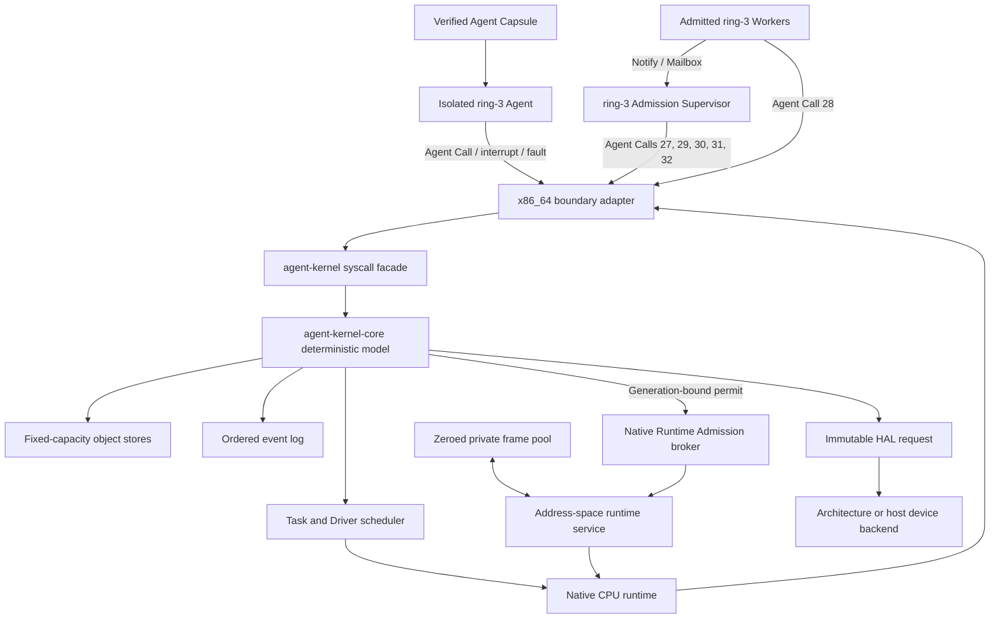

# Agent Kernel

**English** | [简体中文](README.zh-CN.md)

Agent Kernel is an agent-native operating-system kernel written in Rust. Its
primary kernel objects are Agents, Resources, Capabilities, Intents, Tasks,
Events, Verification, and Rollback. The architecture is defined independently
of Linux, shell automation, and POSIX compatibility.

> **Development status:** active kernel development. The freestanding x86_64
> target boots in QEMU and executes isolated ring-3 Agent Capsules. The ABI and
> architecture are under active revision; production stability is planned for
> a later stage.

## System Model

Traditional operating systems give programs process, file, socket, and user
abstractions. An agent-first system needs a different control plane:

- An **Agent** is a kernel-visible execution and authority subject.
- A **Resource** is any kernel-managed object an Agent may control.
- A **Capability** says exactly which Agent may perform which operations on
  which Resource; authority can be attenuated and revoked.
- An **Intent** declares desired work, while a **Task** is its schedulable
  execution unit.
- **Verification** is separate from successful execution.
- **Checkpoint** and **Rollback** are first-class lifecycle operations.
- Every successful mutation produces an ordered **Event** for audit and replay.

There is no ambient superuser inside the native model. High authority is
possible, but it must be represented by explicit capabilities and remains
observable in the event log.

## Current Implementation

The reference BIOS/QEMU configuration boots directly on virtual hardware and
currently provides:

- a permanent GDT, TSS, IDT, ring-0/ring-3 boundary, and private Agent CR3 roots;
- eleven completed isolated native Agent contexts: two initial Workers, a
  Verifier, a Fault Worker, a Fault Handler, a Resource Manager, an Admission
  Supervisor, and four post-reclamation Runtime Service Workers executed in
  two sequential batches;
- kernel-selected FIFO dispatch with physical PIT timer preemption and full CPU
  frame ownership across resume;
- SHA-256-bound, fixed-size Agent Image Capsules with typed Worker, Verifier,
  FaultHandler, and Supervisor entry roles;
- a versioned register-only Agent Call ABI with no userspace pointers;
- blocking mailbox send/receive/acknowledge, wakeup, cooperative yield, task
  results, target-scoped verification, and completion;
- containment of ring-3 `#UD`, `#GP`, and `#PF` faults while kernel-origin
  exceptions remain fatal;
- bounded fault-time reclamation of live private runtime memory before
  `TaskFaulted`: exact-Capability Resource retirement, leaf removal, physical
  frame zeroing and return, fixed-capacity evidence, and restartable CPU
  capture;
- the same bounded transaction on authenticated `CompleteTask`, with completion
  readiness preflight and ordered reclamation evidence attached to the
  completed CPU;
- complete ownership identity for four private page-table frames and seven
  content frames per native Agent, followed by terminal zeroing and transfer
  into a fixed-capacity reusable frame pool;
- an Agent-bound native address-space runtime service that owns allocation,
  exact P4/P3/P2/P1 reconstruction, CPU preparation, and runtime registration
  as one transactional admission;
- a fixed-capacity Runtime Admission object with root-scoped `Delegate`
  authorization, FIFO request preparation, generation-bound permits, bounded
  rejection causes, and atomic admission plus Task queueing;
- an independently configured Runtime Admission capacity, defaulted to the Task
  capacity for source compatibility; the x86 profile provisions 16 Admission
  slots for 12 Tasks, and terminal rejections permit monotonic-ID retries while
  retaining prior evidence until compaction;
- Agent Call 27 and a real ring-3 Admission Supervisor Capsule that creates four
  audited Runtime Admission requests across two rounds, blocks twice in its
  Mailbox, and retains one CPU/address-space context throughout both batches;
- Agent Call 28, which exposes the permit-bound requester only to an admitted
  context; each Runtime Service Worker validates the reply and uses that
  identity as its completion notification recipient;
- Agent Call 29, which lets an authenticated Supervisor compact an authorized
  terminal Runtime Admission prefix, return active capacity, invalidate stale
  permits, and emit one ordered audit Event per retired record;
- Agent Call 30, which lets an authenticated Supervisor compact an authorized
  terminal Task prefix, reject live references, preserve monotonic Task IDs,
  invalidate stale dispatch permits, and emit one ordered audit Event per
  retired Task;
- Agent Call 31, which lets an authenticated Supervisor compact an authorized
  terminal Intent prefix after active Task and Message references are gone,
  preserve monotonic Intent IDs, and emit one ordered audit Event per retired
  Intent;
- Agent Call 32, which lets an authenticated Supervisor retire one revoked
  Capability leaf after every live child, Task, Agent Entry, Runtime Admission,
  and unacknowledged Message reference is gone; retired child Resources can be
  cleaned through active ancestor `Rollback` authority;
- an x86 admission broker that verifies each permit-bound Capsule, drives the
  existing address-space service, commits semantic admission, and restores the
  physical runtime transaction if the semantic commit cannot proceed;
- four authenticated Worker completion notifications that wake the retained
  Supervisor call frame across two FIFO receive/acknowledgement rounds;
- two generation-bound Runtime Admission release batches that require verified,
  idle targets and preflight aggregate event capacity: batch one returns 22
  frames while the Supervisor retains eleven; the Supervisor later compacts
  released Admissions 1 and 2, and the terminal batch returns the final 33
  frames while retaining released Admissions 3 and 4;
- post-build cancellation that clears and atomically restores all eleven frames
  after duplicate runtime registration, followed by cross-batch physical reuse:
  Agents 13 and 14 consume the exact zeroed identities released by Agents 11
  and 10 while the Supervisor identity remains disjoint and resident;
- policy routing to a real ring-3 Fault Handler, followed by capability-gated
  retained-page repair and same-frame resume;
- a real ring-3 Resource Manager that creates a child Service through delegated
  `Act` authority, derives attenuated `Observe` authority for another Agent,
  revokes that direct child through `Delegate`, retires the Service through
  `Rollback`, declares a new `Act` Intent, creates its Task, and delegates that
  Task to a registered Agent with a kernel-issued task capability;
- a native Agent Manager protocol in the same ring-3 Capsule that registers
  Agent 9 under root-scoped `Delegate` authority, then suspends, resumes, and
  retires the unlaunched identity through four authenticated Agent Calls;
- a shared 16-frame runtime pool with deterministic allocation, full-page
  zeroing, and ownership records bound to Agent, Resource, MemoryCell, and
  allocation generation;
- physically backed runtime memory lifecycles for a compatibility page and
  kernel-selected regions of one to four pages, including ring-3 proof writes,
  first/last-page inspection, concurrent live mappings, deterministic
  first-fit hole reuse, leaf removal, and frame reclamation;
- a fixed-capacity ordered region-observation log that carries allocation
  identity and ring-3 proof values into terminal kernel evidence;
- a kernel-authorized Driver flow from UART interrupt through endpoint lookup,
  immutable HAL request, Port I/O, result recording, and invocation completion.

The reference validation profile enforces these deterministic invariants:

| Evidence | Count |
| --- | ---: |
| Registered Agents | 14 |
| Native ring-3 completions | 11 |
| Kernel-selected dispatches | 35 |
| Resource Manager Agent Calls | 29 |
| Resource Manager Agent/kernel address-space switches | 58 |
| Admission Supervisor Agent Calls | 24 |
| Admission Supervisor Agent/kernel address-space switches | 48 |
| Runtime Service Worker Agent Calls | 20 |
| Runtime Service Worker Agent/kernel address-space switches | 40 |
| Physical quantum expiries | 15 |
| Task store capacity | 12 |
| Compacted terminal Tasks | 6 |
| Active Tasks after prefix compaction | 6 |
| Task compaction Events | 6 |
| Intent store capacity | 12 |
| Compacted terminal Intents | 6 |
| Active Intents after prefix compaction | 6 |
| Intent compaction Events | 6 |
| Runtime Admission store capacity | 16 |
| Runtime Admission requests | 4 |
| Runtime Admission commits | 4 |
| Runtime Admission requester discoveries | 4 |
| Runtime Admission releases | 4 |
| Runtime Admission compaction Events | 2 |
| Retained terminal Runtime Admission records | 2 |
| Worker completion notifications | 4 |
| Resident Supervisor Mailbox waits | 2 |
| Resident Supervisor Mailbox wakes | 2 |
| Contained Agent faults | 4 |
| Fault-owned live regions reclaimed | 1 |
| Fault-owned physical frames reclaimed | 2 |
| Completion-owned live regions reclaimed | 1 |
| Completion-owned physical frames reclaimed | 3 |
| Rejected native admission cancellations | 1 |
| Frames restored by admission cancellation | 11 |
| Native address-space reclamation completions | 11 |
| Cumulative terminal private-frame returns | 121 |
| Final zeroed private address-space frame pool | 66 |
| Resources after Manager execution | 7 |
| Capability store capacity | 26 |
| Occupied Capability slots after compaction and reuse | 26 |
| Compacted Capability records | 2 |
| Reused Capability slots | 2 |
| MemoryCells after Manager execution | 5 |
| Shared runtime frames returned and zeroed | 16 |
| Ordered kernel events after Driver completion | 356 |

`scripts/run-qemu.sh` validates every event in order and rejects missing
markers, extra events, an unexpected QEMU exit status, or any fail-closed boot
path.

## Architecture



The kernel remains deterministic and compact. A userspace Supervisor owns LLM
inference, prompts, remote model calls, and high-level planning; kernel space
owns deterministic execution and authority primitives.

## Workspace

| Crate | Responsibility |
| --- | --- |
| `agent-kernel-core` | `no_std` AgentOS object model, authorization, lifecycle, scheduler, and events |
| `agent-kernel` | `no_std` syscall-style facade over the core |
| `agent-kernel-hal` | Immutable, kernel-authorized device request contract |
| `agent-kernel-boot` | Deterministic bootstrap handoff and fixed capacities |
| `agent-kernel-x86_64` | Freestanding x86_64 boot, isolation, interrupts, faults, Agent Calls, and QEMU validation |
| `agent-kernel-image` | Host utility that builds the BIOS disk image |
| `agent-supervisor` | Host-side userspace simulation and virtual device backend |

All kernel stores use fixed capacities. The core and facade are heap-free and
host-independent, with explicit state ownership and deterministic inputs.

## Agent Call ABI

Agent Calls cross the ring-3 boundary through a fixed register frame. Every
mutating request is authenticated against scheduler-owned Agent, Task, Image,
and nonce state before it reaches the facade.

| Operation | ID | Purpose |
| --- | ---: | --- |
| `DescribeContext` | 1 | Establish trusted execution identity and nonce |
| `Yield` | 2 | Cooperatively return the running Task to the queue |
| `CompleteTask` | 3 | Reclaim live private memory and complete the authenticated Task |
| `SubmitTaskResult` | 4 | Store a fixed-width Task result |
| `InspectTaskResult` | 5 | Inspect one authorized target result |
| `VerifyTask` | 6 | Commit target-scoped verification |
| `SendMessage` | 7 | Send a typed kernel-object message |
| `ReceiveMessage` | 8 | Receive or atomically enter mailbox wait |
| `AcknowledgeMessage` | 9 | Acknowledge the received message |
| `CreateResource` | 10 | Create a child Resource through explicit parent authority |
| `RetireResource` | 11 | Retire a Resource through its `Rollback` capability |
| `DeriveCapability` | 12 | Attenuate source authority for another registered Agent |
| `RevokeDerivedCapability` | 13 | Revoke one direct child through its `Delegate` source |
| `DeclareIntent` | 14 | Declare typed work through explicit Resource authority |
| `CreateTask` | 15 | Create a Task from an owned declared Intent |
| `DelegateTask` | 16 | Delegate a created Task and issue task-scoped authority |
| `RegisterManagedAgent` | 17 | Register an unlaunched Agent under Resource-scoped management authority |
| `SuspendManagedAgent` | 18 | Suspend a quiescent managed Agent |
| `ResumeManagedAgent` | 19 | Reactivate a suspended managed Agent |
| `RetireManagedAgent` | 20 | Commit the terminal state of a quiescent managed Agent |
| `AllocateMemoryPage` | 21 | Map one kernel-selected private page under an owned Memory Resource |
| `InspectMemoryPage` | 22 | Audit and return the first fixed-width value from the mapped page |
| `ReleaseMemoryPage` | 23 | Retire its Memory Resource, remove the leaf, and clear the frame |
| `AllocateMemoryRegion` | 24 | Map a kernel-selected region of one to four pages under an owned Memory Resource |
| `InspectMemoryRegion` | 25 | Audit and return the first value from the first and last mapped pages |
| `ReleaseMemoryRegion` | 26 | Retire its Memory Resource, remove every leaf, clear every frame, and return the region to the pool |
| `RequestRuntimeAdmission` | 27 | Request audited native runtime admission for one accepted, unqueued target Task |
| `DiscoverRuntimeAdmission` | 28 | Return the kernel-owned requester bound to the current admitted context |
| `CompactRuntimeAdmissions` | 29 | Retire an authorized terminal prefix from the active admission queue |
| `CompactTasks` | 30 | Retire an authorized terminal prefix from the active Task store |
| `CompactIntents` | 31 | Retire an authorized terminal prefix from the active Intent store |
| `CompactCapability` | 32 | Retire one authorized revoked leaf from the sparse Capability store |

The native resource ABI accepts AgentOS-oriented Workspace, Memory, Service,
Network, and Device kinds. Unknown kinds, unknown operation bits, zero handles,
stale nonces, wrong identities, and non-zero reserved registers fail closed.
The Task Manager ABI accepts the five native Intent kinds and explicit optional
or required verification policy codes. Agent management requires an active,
root-scoped `Delegate` Capability on the identity's management Resource. The
target must have an idle execution context, no launch entry, and no active
assigned Task. Runtime memory calls accept only Capability and kernel-object
handles plus a bounded page count. Virtual addresses, physical frames, access
flags, and byte lengths remain kernel-selected.

Runtime admission requires an authenticated Supervisor entry and an active,
root-scoped `Delegate` Capability on the target Task Resource. The kernel binds
the request to the target Agent, Task, verified Image, and Resource. The x86
broker receives only a generation-checked permit and commits queue visibility
after physical registration succeeds. The broker carries the permit requester
into the admitted CPU context; operation 28 returns it through a canonical,
authenticated, read-only reply. Operation 29 requires `Delegate` authority for
every selected Resource, compacts only a contiguous `Rejected` or `Released`
prefix, preserves monotonic IDs, and records every retired identity in the
Event log. Operation 30 requires root-scoped `Rollback` authority for every
selected Task Resource. It accepts only a contiguous `Verified`/`Fulfilled` or
`Cancelled`/`Cancelled` prefix with no active queue, execution, waiter,
admission, Namespace, or Message reference. Successful compaction advances the
Task generation, preserves monotonic IDs, and records the complete retired Task
identity in ordered Events. Operation 31 requires root-scoped `Rollback`
authority for every selected Intent Resource. It accepts only a contiguous
`Fulfilled` or `Cancelled` prefix after all active Task and unacknowledged
Message references are gone, preserves monotonic Intent IDs, and records the
original kind, Resource, owner, and verification requirement in ordered Events.
Operation 32 requires an authenticated Supervisor and active root-scoped
`Rollback` authority. It accepts one revoked Capability with no retained child
or live kernel-object reference, clears exactly one sparse slot, preserves
monotonic IDs, and emits a `CapabilityCompacted` Event. An active target
Resource requires exact scope; a retired target Resource accepts authority from
an active ancestor in its immutable Resource chain.

## Quick Start

### Requirements

- Rust installed through `rustup`;
- the repository's pinned nightly toolchain, `rust-src`, LLVM tools, and
  `x86_64-unknown-none` target (installed automatically from
  `rust-toolchain.toml` by rustup-managed Cargo);
- `qemu-system-x86_64` for the freestanding x86_64 validation target.

On macOS, QEMU can be installed with:

```bash
brew install qemu
```

### Build And Test

```bash
git clone https://github.com/Evan-master/agent-kernel.git
cd agent-kernel

cargo fmt --check
cargo test --workspace
cargo run -p agent-supervisor
```

### Run The x86_64 Validation Target

```bash
scripts/run-qemu.sh
scripts/run-qemu.sh --release
```

The scripts build the freestanding target, create a BIOS image, start QEMU,
validate the complete serial transcript, require exactly 356 events, and treat
the kernel's debug-exit status as part of the contract. A successful run
includes these proof lines:

```text
AGENT_KERNEL_NATIVE_FAULT_MEMORY_RECLAIMED_OK
AGENT_KERNEL_NATIVE_COMPLETION_MEMORY_RECLAIMED_OK
AGENT_KERNEL_RUNTIME_FRAME_POOL_RELEASED_OK
AGENT_KERNEL_NATIVE_ADDRESS_SPACE_RECLAIMED_OK
AGENT_KERNEL_NATIVE_ADDRESS_SPACE_FRAME_POOL_OK
AGENT_KERNEL_NATIVE_ADDRESS_SPACE_RUNTIME_CANCEL_OK
AGENT_KERNEL_NATIVE_ADDRESS_SPACE_ALLOCATED_OK
AGENT_KERNEL_NATIVE_ADDRESS_SPACE_REBUILT_OK
AGENT_KERNEL_NATIVE_ADDRESS_SPACE_RUNTIME_BATCH_OK
AGENT_KERNEL_NATIVE_ADDRESS_SPACE_RUNTIME_CONCURRENCY_OK
AGENT_KERNEL_RUNTIME_ADMISSION_CAPACITY_OK
AGENT_KERNEL_AGENT_CALL_RUNTIME_ADMISSION_REQUEST_OK
AGENT_KERNEL_AGENT_CALL_RUNTIME_ADMISSION_DISCOVERY_OK
AGENT_KERNEL_AGENT_CALL_RUNTIME_ADMISSION_COMPACTION_OK
AGENT_KERNEL_TASK_PREFIX_VERIFIED_OK
AGENT_KERNEL_AGENT_CALL_TASK_COMPACTION_OK
AGENT_KERNEL_AGENT_CALL_INTENT_COMPACTION_OK
AGENT_KERNEL_AGENT_CALL_CAPABILITY_COMPACTION_OK
AGENT_KERNEL_NATIVE_RUNTIME_ADMISSION_REQUEST_OK
AGENT_KERNEL_NATIVE_RUNTIME_ADMISSION_RESIDENT_WAIT_OK
AGENT_KERNEL_NATIVE_RUNTIME_ADMISSION_NOTIFICATION_OK
AGENT_KERNEL_NATIVE_RUNTIME_ADMISSION_SUPERVISOR_OK
AGENT_KERNEL_NATIVE_RUNTIME_ADMISSION_COMMIT_OK
AGENT_KERNEL_NATIVE_RUNTIME_ADMISSION_RELEASE_OK
AGENT_KERNEL_NATIVE_ADDRESS_SPACE_PARTIAL_RECLAIM_OK
AGENT_KERNEL_NATIVE_RUNTIME_ADMISSION_REPEAT_OK
AGENT_KERNEL_NATIVE_RUNTIME_ADMISSION_COMPACTION_OK
AGENT_KERNEL_NATIVE_TASK_COMPACTION_OK
AGENT_KERNEL_NATIVE_INTENT_COMPACTION_OK
AGENT_KERNEL_NATIVE_CAPABILITY_COMPACTION_OK
AGENT_KERNEL_NATIVE_ADDRESS_SPACE_REUSE_EXECUTION_OK
AGENT_KERNEL_NATIVE_ADDRESS_SPACE_REUSED_RECLAIMED_OK
AGENT_KERNEL_NATIVE_RESOURCE_MANAGER_AGENT_OK
AGENT_KERNEL_NATIVE_CAPABILITY_MANAGER_OK
AGENT_KERNEL_NATIVE_TASK_MANAGER_OK
AGENT_KERNEL_NATIVE_AGENT_MANAGER_OK
AGENT_KERNEL_NATIVE_MEMORY_PAGE_MANAGER_OK
AGENT_KERNEL_NATIVE_MEMORY_REGION_MANAGER_OK
AGENT_KERNEL_NATIVE_MEMORY_CONCURRENCY_OK
AGENT_KERNEL_DRIVER_INVOCATION_FLOW_OK
event[356] driver_invocation_completed
SUPERVISOR_HANDOFF_READY
```

## Authority And Failure Model

- Resource access always flows through an explicit capability.
- Task-scoped capabilities cannot silently become generic Resource authority.
- Derived authority cannot exceed its source and is invalidated by ancestor
  revocation.
- Architecture adapters route every mutation through public facade methods.
- Capacity checks occur before multi-record mutations so failures remain atomic.
- Compacted lifecycle history remains queryable through Events, while retained
  terminal objects reject future active use.
- Malformed Capsules, calls, CPU frames, event sequences, or physical ownership
  evidence terminate the validation run under the fail-closed policy.

High-authority Agents receive explicit, composable, revocable, and auditable
authority.

## Implemented And Planned

### Implemented

- Agent, Resource, Capability, Intent, Task, Action, Observation, Verification,
  Checkpoint, Rollback, Message, Fault, Driver, Memory Cell, Namespace, and
  Event primitives;
- capability grant, attenuation, task delegation, source-revocation
  propagation, authenticated direct-child revocation, resource ownership, and
  retirement;
- fixed-capacity scheduling, wait/wake, mailbox IPC, fault policy, image
  verification, semantic Runtime Admission, and Driver invocation lifecycle;
- freestanding x86_64 isolation, timer preemption, fault containment/recovery,
  native Resource, Capability, Intent, Task, managed Agent, shared physical
  frame-pool, compatibility-page, and multi-page memory-region lifecycle calls;
- deterministic fault-time retirement of live Memory Resources, private leaf
  removal, frame zeroing and return, bounded reclamation evidence, and restart
  after cleanup;
- authenticated completion-time retirement of live Memory Resources through
  the same fixed-capacity cleanup transaction;
- complete private page-table/content ownership tracking and terminal
  reclamation of six native address spaces into a 66-frame zeroed pool;
- Agent-bound, generation-checked eleven-frame allocation from that pool and a
  transactional runtime service spanning private hierarchy reconstruction,
  CPU preparation, and native runtime registration;
- a ring-3 Admission Supervisor, authenticated Agent Calls 27 through 32,
  independently configured fixed-capacity admission records, terminal retry,
  generation-bound permits, requester-bound admitted contexts, and a broker
  that connects audited semantic requests to the physical runtime service;
- resident Supervisor Mailbox waiting across two admission and execution
  batches, authenticated Worker notifications, FIFO acknowledgement, partial
  Worker reclamation, and final three-address-space reclamation;
- opaque, generation-bound release batches that link verified idle Tasks to
  post-reclamation `RuntimeAdmissionReleased` records and ordered kernel events;
- authorized terminal-prefix compaction with FIFO retention, monotonic IDs,
  stale-permit invalidation, active-capacity reuse, and per-record Events;
- authorized Task-prefix compaction with terminal Intent consistency, complete
  active-reference preflight, queue cleanup on cancellation, monotonic IDs,
  generation-bound dispatch permits, and per-Task Events;
- authorized Intent-prefix compaction with terminal-state checks, active Task
  and Message reference preflight, monotonic IDs, and complete per-Intent
  Events;
- authorized sparse Capability compaction with leaf-first ordering, live
  reference preflight, retired-Resource ancestor authority, monotonic IDs, hole
  reuse, and complete per-Capability Events;
- complete rollback after rejected post-build admission, plus concurrent
  ownership, FIFO ring-3 execution, semantic verification, partial reclamation,
  and exact cross-batch frame reuse for four Runtime Service Workers;
- a fixed 2 MiB guarded kernel boot stack for the 356-event reference profile.

### Planned

- dynamic page-table growth beyond the fixed private hierarchy;
- bounded retention policies for Capabilities, Agent entries, Messages,
  Waiters, Faults, and Events;
- SMP scheduling, multi-core synchronization, or hardware TLB shootdown;
- general storage, networking, graphics, USB, or physical hardware support;
- an Agent package/application format beyond the current bounded Capsule format;
- a production userspace Supervisor, model runtime, or policy planner;
- POSIX/Linux/Windows compatibility layers;
- production security hardening, formal verification, or stable ABI guarantees.

See the current [Capability Store Compaction design](docs/superpowers/specs/2026-07-19-capability-store-compaction-v1-design.md)
and [implementation plan](docs/superpowers/plans/2026-07-19-capability-store-compaction-v1.md)
for the latest milestone contract. Earlier design records remain under
`docs/superpowers/specs/`.

## Contributing

Before changing code, read [AGENTS.md](AGENTS.md). Contributions must preserve
the kernel architecture and validation contracts. In particular:

- keep the native model Agent-first and confine POSIX support to compatibility
  layers;
- preserve `no_std`, determinism, fixed-capacity storage, and explicit events;
- add failing tests before new runtime behavior;
- route every privileged mutation through explicit capability checks;
- run the workspace, Supervisor, and relevant QEMU validation before publishing.

## License

[MIT](LICENSE)
