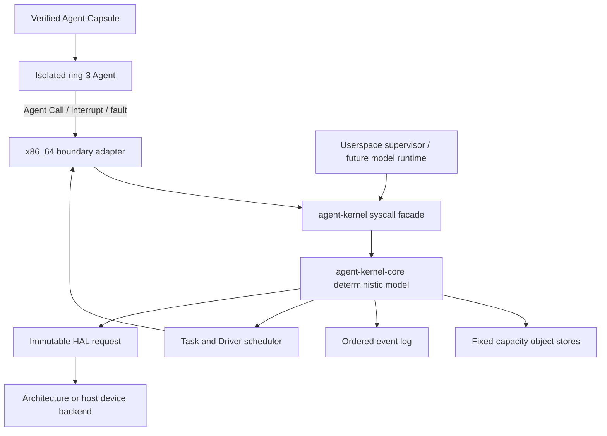

# Agent Kernel

**English** | [简体中文](README.zh-CN.md)

Agent Kernel is an experimental, agent-native operating-system kernel written
in Rust. It is not a Linux distribution, a shell-controlling agent, or a POSIX
compatibility layer. Its primary kernel objects are Agents, Resources,
Capabilities, Intents, Tasks, Events, Verification, and Rollback.

> **Project status:** early research prototype. It boots a freestanding x86_64
> kernel in QEMU and executes isolated ring-3 Agent Capsules, but it is not yet
> a general-purpose or production operating system.

## Why Agent-Native

Traditional operating systems give programs process, file, socket, and user
abstractions. An agent-first system needs a different control plane:

- An **Agent** is a kernel-visible execution and authority subject.
- A **Resource** is any kernel-managed object an Agent may control.
- A **Capability** says exactly which Agent may perform which operations on
  which Resource; authority can be attenuated and revoked.
- An **Intent** declares desired work, while a **Task** is its schedulable
  execution unit.
- **Verification** is separate from successful execution.
- **Checkpoint** and **Rollback** are first-class lifecycle operations.
- Every successful mutation produces an ordered **Event** for audit and replay.

There is no ambient superuser inside the native model. High authority is
possible, but it must be represented by explicit capabilities and remains
observable in the event log.

## What Runs Today

The current BIOS/QEMU proof boots without Linux or another host OS underneath
the kernel and demonstrates:

- a permanent GDT, TSS, IDT, ring-0/ring-3 boundary, and private Agent CR3 roots;
- six isolated native Agent contexts: two Workers, a Verifier, a Fault Worker,
  a Fault Handler, and a Resource Manager;
- kernel-selected FIFO dispatch with physical PIT timer preemption and full CPU
  frame ownership across resume;
- SHA-256-bound, fixed-size Agent Image Capsules with typed Worker, Verifier,
  FaultHandler, and Supervisor entry roles;
- a versioned register-only Agent Call ABI with no userspace pointers;
- blocking mailbox send/receive/acknowledge, wakeup, cooperative yield, task
  results, target-scoped verification, and completion;
- containment of ring-3 `#UD`, `#GP`, and `#PF` faults while kernel-origin
  exceptions remain fatal;
- policy routing to a real ring-3 Fault Handler, followed by capability-gated
  retained-page repair and same-frame resume;
- a real ring-3 Resource Manager that creates a child Service through delegated
  `Act` authority, receives a new capability, retires the Service through
  `Rollback`, and completes with both kernel handles;
- a kernel-authorized Driver flow from UART interrupt through endpoint lookup,
  immutable HAL request, Port I/O, result recording, and invocation completion.

The deterministic terminal proof currently requires exactly:

| Evidence | Count |
| --- | ---: |
| Registered Agents | 8 |
| Native ring-3 completions | 6 |
| Kernel-selected dispatches | 23 |
| Physical quantum expiries | 10 |
| Contained Agent faults | 4 |
| Resources after Manager execution | 2 |
| Capabilities after Manager execution | 11 |
| Ordered kernel events after Driver completion | 169 |

`scripts/run-qemu.sh` checks every event in order and rejects missing markers,
extra events, wrong QEMU exit status, or any fail-closed boot path.

## Architecture



The kernel is deliberately deterministic and small. LLM inference, prompts,
remote model calls, and high-level planning belong in a userspace Supervisor,
not in kernel space.

## Workspace

| Crate | Responsibility |
| --- | --- |
| `agent-kernel-core` | `no_std` AgentOS object model, authorization, lifecycle, scheduler, and events |
| `agent-kernel` | `no_std` syscall-style facade over the core |
| `agent-kernel-hal` | Immutable, kernel-authorized device request contract |
| `agent-kernel-boot` | Deterministic bootstrap handoff and fixed capacities |
| `agent-kernel-x86_64` | Freestanding x86_64 boot, isolation, interrupts, faults, Agent Calls, and QEMU proof |
| `agent-kernel-image` | Host utility that builds the BIOS disk image |
| `agent-supervisor` | Host-side userspace simulation and virtual device backend |

All kernel stores use fixed capacities. The core and facade do not use heap
allocation, host files, sockets, threads, randomness, or hidden mutable globals.

## Agent Call ABI

Agent Calls cross the ring-3 boundary through a fixed register frame. Every
mutating request is authenticated against scheduler-owned Agent, Task, Image,
and nonce state before it reaches the facade.

| Operation | ID | Purpose |
| --- | ---: | --- |
| `DescribeContext` | 1 | Establish trusted execution identity and nonce |
| `Yield` | 2 | Cooperatively return the running Task to the queue |
| `CompleteTask` | 3 | Complete the authenticated Task |
| `SubmitTaskResult` | 4 | Store a fixed-width Task result |
| `InspectTaskResult` | 5 | Inspect one authorized target result |
| `VerifyTask` | 6 | Commit target-scoped verification |
| `SendMessage` | 7 | Send a typed kernel-object message |
| `ReceiveMessage` | 8 | Receive or atomically enter mailbox wait |
| `AcknowledgeMessage` | 9 | Acknowledge the received message |
| `CreateResource` | 10 | Create a child Resource through explicit parent authority |
| `RetireResource` | 11 | Retire a Resource through its `Rollback` capability |

The native resource ABI accepts AgentOS-oriented Workspace, Memory, Service,
Network, and Device kinds. Unknown kinds, unknown operation bits, zero handles,
stale nonces, wrong identities, and non-zero reserved registers fail closed.

## Quick Start

### Requirements

- Rust installed through `rustup`;
- the repository's pinned nightly toolchain, `rust-src`, LLVM tools, and
  `x86_64-unknown-none` target (installed automatically from
  `rust-toolchain.toml` by rustup-managed Cargo);
- `qemu-system-x86_64` for the bare-metal proof.

On macOS, QEMU can be installed with:

```bash
brew install qemu
```

### Build And Test

```bash
git clone https://github.com/Evan-master/agent-kernel.git
cd agent-kernel

cargo fmt --check
cargo test --workspace
cargo run -p agent-supervisor
```

### Boot In QEMU

```bash
scripts/run-qemu.sh
scripts/run-qemu.sh --release
```

The scripts build the freestanding target, create a BIOS image, start QEMU,
validate the complete serial transcript, require exactly 169 events, and treat
the kernel's debug-exit status as part of the contract. A successful run ends
with:

```text
AGENT_KERNEL_NATIVE_RESOURCE_MANAGER_AGENT_OK
AGENT_KERNEL_DRIVER_INVOCATION_FLOW_OK
event[169] driver_invocation_completed
SUPERVISOR_HANDOFF_READY
```

## Authority And Failure Model

- Resource access always flows through an explicit capability.
- Task-scoped capabilities cannot silently become generic Resource authority.
- Derived authority cannot exceed its source and is invalidated by ancestor
  revocation.
- Architecture adapters call public facade methods; they do not mutate core
  stores directly.
- Capacity checks occur before multi-record mutations so failures remain atomic.
- Retired objects remain queryable for audit but reject future active use.
- Malformed Capsules, calls, CPU frames, event sequences, or physical ownership
  evidence terminate the QEMU proof instead of falling back to permissive
  behavior.

This project explores high-authority Agents. The design goal is not to reduce
their authority to ordinary application permissions; it is to make broad
authority explicit, composable, revocable, and auditable.

## Implemented And Planned

### Implemented

- Agent, Resource, Capability, Intent, Task, Action, Observation, Verification,
  Checkpoint, Rollback, Message, Fault, Driver, Memory Cell, Namespace, and
  Event primitives;
- capability grant, attenuation, task delegation, source-revocation
  propagation, resource ownership, and retirement;
- fixed-capacity scheduling, wait/wake, mailbox IPC, fault policy, image
  verification, runtime admission, and Driver invocation lifecycle;
- freestanding x86_64 isolation, timer preemption, fault containment/recovery,
  and native resource lifecycle calls.

### Not Yet Implemented

- a general physical/virtual memory manager or dynamic userspace allocator;
- SMP scheduling, multi-core synchronization, or hardware TLB shootdown;
- general storage, networking, graphics, USB, or physical hardware support;
- an Agent package/application format beyond the bounded Capsule prototype;
- a production userspace Supervisor, model runtime, or policy planner;
- POSIX/Linux/Windows compatibility layers;
- production security hardening, formal verification, or stable ABI guarantees.

See the current [Resource Manager design](docs/superpowers/specs/2026-07-17-x86-native-resource-manager-agent-v0-design.md)
and [implementation plan](docs/superpowers/plans/2026-07-17-x86-native-resource-manager-agent-v0.md)
for the latest milestone contract. Earlier design records remain under
`docs/superpowers/specs/`.

## Contributing

This is a public repository. Anyone may fork it and submit a Pull Request, but
public visibility does not grant push or merge access. Repository maintainers
decide what enters `main`.

Before changing code, read [AGENTS.md](AGENTS.md). In particular:

- keep the native model Agent-first rather than POSIX-first;
- preserve `no_std`, determinism, fixed-capacity storage, and explicit events;
- add failing tests before new runtime behavior;
- never add capability bypasses or hidden privileged mutation paths;
- run the workspace, Supervisor, and relevant QEMU proof before publishing.

## License

[MIT](LICENSE)
