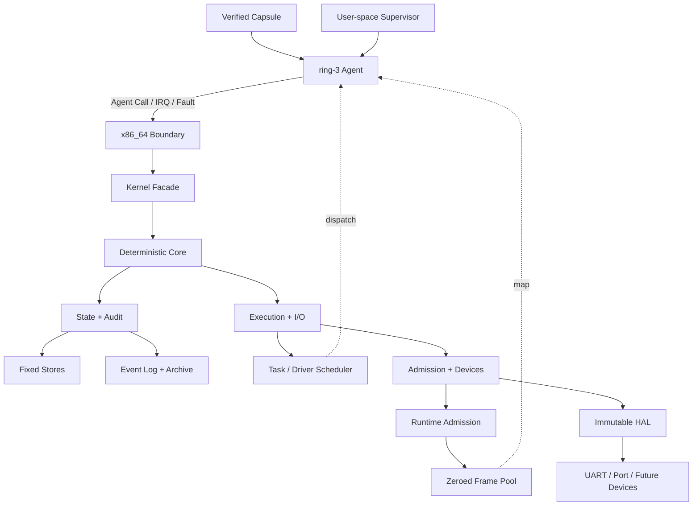

<h1 align="center">Agent Kernel</h1>

<p align="center">
  <strong>Agent-native · Capability-gated · Event-driven · Rust bare-metal kernel</strong>
</p>

<p align="center">
  <strong>English</strong> · <a href="README.zh-CN.md">简体中文</a>
</p>

<p align="center">
  
  
  
  
</p>

```text
AGENT
  |
CAPABILITY
  `- explicit authority
  |
RESOURCE
  |
EVENT
  |- deterministic evidence
  `- replayable / auditable
```

Agent Kernel is an agent-native operating-system kernel written in Rust.

It boots directly on x86_64 virtual hardware and treats Agents, Capabilities,
Intents, Tasks, Verification, Rollback, and Events as primary system objects.

> [!IMPORTANT]
> Active kernel development. The QEMU reference target executes isolated
> ring-3 Agent Capsules; the ABI, hardware coverage, and production security
> model continue to evolve.

```console
$ scripts/run-qemu.sh --release
AGENT_KERNEL_QEMU_BOOT_OK
AGENT_KERNEL_NATIVE_NAMESPACE_MANAGER_OK
AGENT_KERNEL_NATIVE_EVENT_ARCHIVE_REPLAY_OK
event[396] driver_invocation_completed
SUPERVISOR_HANDOFF_READY
```

## Navigate

[Kernel Contract](#kernel-contract) · [Running System](#running-system) ·
[Architecture](#architecture) · [Agent Call ABI](#agent-call-abi) ·
[Proof Profile](#proof-profile) · [Quick Start](#quick-start) · [Roadmap](#roadmap)

## Kernel Contract

| Object | Kernel meaning |
| --- | --- |
| `Agent` | Executable, schedulable, authenticated authority subject |
| `Resource` | Controlled Workspace, Memory, Service, Network, Device, or other object |
| `Capability` | Explicit Agent operations on one Resource; attenuable, derivable, revocable |
| `Intent` | Typed declaration of desired work |
| `Task` | Schedulable execution unit created from an Intent |
| `Verification` | Trust decision kept separate from execution completion |
| `Checkpoint / Rollback` | First-class recovery and cleanup authority |
| `Event` | Ordered deterministic evidence for every successful mutation |
| `Namespace` | Workspace directory from fixed-width keys to typed kernel objects |

```text
Observe  Act  Verify  Checkpoint  Rollback  Delegate
   |      |      |        |           |          |
   +------+------+- Capability ------+----------+
```

The native model has no ambient superuser. High authority is explicit and
remains visible in the audit chain.

## Running System

| Subsystem | Current capability | QEMU proof |
| --- | --- | --- |
| Boot and privilege | BIOS boot, GDT, TSS, IDT, ring-0/ring-3 call gate | `AGENT_KERNEL_GDT_TSS_OK` |
| Isolation and scheduling | Private Agent CR3 roots, FIFO dispatch, PIT preemption, CPU resume | `AGENT_KERNEL_MULTI_AGENT_CONTEXT_SWITCH_OK` |
| Agent execution | SHA-256 Capsules, typed entries, 11 completed contexts | `AGENT_KERNEL_HETEROGENEOUS_AGENT_EXECUTION_OK` |
| Memory | Private tables, page/region allocation, First-Fit reuse, zeroed frame pool | `AGENT_KERNEL_NATIVE_MEMORY_CONCURRENCY_OK` |
| Faults | ring-3 `#UD`, `#GP`, `#PF` containment, routing, repair, recovery | `AGENT_KERNEL_NATIVE_AGENT_FAULT_RESTART_OK` |
| IPC | Blocking Mailbox, wakeup, acknowledgement, Message retirement | `AGENT_KERNEL_NATIVE_MAILBOX_IPC_OK` |
| Managers | Resource, Capability, Task, Agent, Memory, Namespace | `AGENT_KERNEL_NATIVE_RESOURCE_MANAGER_AGENT_OK` |
| Runtime Admission | Permits, broker, release batches, address-space rebuild | `AGENT_KERNEL_NATIVE_RUNTIME_ADMISSION_COMMIT_OK` |
| Driver | UART IRQ, Endpoint, HAL request, Port I/O, Invocation | `AGENT_KERNEL_DRIVER_INVOCATION_FLOW_OK` |
| Audit | Fixed Event Log, SHA-256 archive chain, exact replay | `AGENT_KERNEL_NATIVE_EVENT_ARCHIVE_REPLAY_OK` |

Every Core Store has an explicit fixed capacity. `agent-kernel-core` and
`agent-kernel` remain `no_std`, heap-free, host-I/O-free, and free of hidden
global mutable state.

## Architecture



### Boundary

| Layer | Responsibility |
| --- | --- |
| Kernel space | Identity, authority, scheduling, isolation, reclamation, deterministic state, audit |
| User space | LLM inference, prompts, planning, policy, model runtime, external adapters |
| HAL | Immutable device requests already authorized by the kernel |

## Agent Call ABI

Agent Calls cross ring 3 through a fixed register frame. The current ABI exposes
47 operations.

```text
rax = magic     rbx = ABI version     rcx = operation / status
r8  = Agent     rdi = Task            rsi = Image
r9  = Nonce     r10..r15, rbp = bounded operation payload
```

No userspace pointer enters the ABI. Mutating requests must match the Agent,
Task, Image, and Nonce held by the scheduler. Reserved registers must be zero.

| ID range | Protocol family | Primary operations |
| ---: | --- | --- |
| `1-9` | Execution / IPC | Context, Yield, Result, Verify, Mailbox, Complete |
| `10-16` | Resource / Work | Resource, Capability, Intent, Task, Delegation |
| `17-20` | Agent Manager | Register, Suspend, Resume, Retire |
| `21-26` | Runtime Memory | Page and Region Allocate, Inspect, Release |
| `27-28` | Runtime Admission | Request and trusted requester discovery |
| `29-43` | Lifecycle / Archive | Store reclamation, Event archive, cleanup revocation |
| `44-47` | Namespace Manager | Bind, Resolve, Rebind, Retire |

### Namespace Calls

| Call | ID | Authority | Result |
| --- | ---: | --- | --- |
| `BindNamespaceEntry` | 44 | `Act` | Allocate a monotonic Entry ID and return the full record |
| `ResolveNamespaceEntry` | 45 | `Observe` | Return the full record and append audit evidence |
| `RebindNamespaceEntry` | 46 | `Act` | Replace the typed object and advance its revision |
| `RetireNamespaceEntry` | 47 | `Rollback` | Remove stably from the dense Store and return capacity |

Objects use `(object_id << 3) | tag` and cover Agent, Resource, Task, Message,
and MemoryCell. Zero IDs, reserved tags, oversized IDs, and non-zero reserved
registers fail closed.

<details>
<summary><strong>ABI invariants</strong></summary>

- Call identity comes from the scheduled execution context.
- Core rechecks Capability scope and operation bits.
- Multi-record transactions preflight capacity and live references.
- Every successful mutation appends an Event.
- Canonical replies clear unrelated registers.
- Capsule, CPU-frame, or evidence mismatch terminates validation.

</details>

## Proof Profile

### Reference Profile

| Metric | Value |
| --- | ---: |
| Architecture | `x86_64-unknown-none` |
| Completed isolated Agent contexts | 11 |
| Kernel-selected dispatches | 35 |
| Resource Manager Calls / CR3 switches | `39 / 78` |
| Admission Supervisor Calls / CR3 switches | `44 / 88` |
| Namespace Store capacity / final occupancy | `1 / 1` |
| Live Event capacity / pre-archive occupancy | `362 / 362` |
| Archived Events | 64 |
| Final live Events / next sequence | `332 / 397` |
| Complete transcript | Events `1..396` |
| Private address-space frames returned and zeroed | 66 |
| Shared runtime frames returned and zeroed | 16 |

### Native Capsules

| Capsule | Calls | Switches | Bytes |
| --- | ---: | ---: | ---: |
| Resource Manager | 39 | 78 | 3,848 |
| Admission Supervisor | 44 | 88 | 4,114 |

The Rust arrays match independently assembled machine code byte for byte. Each
complete Capsule occurs exactly once in the Release ELF.

<details>
<summary><strong>Show full Capsule digests</strong></summary>

```text
resource_manager
8914b2dc4f1a1c5d93d6d7315ee5e289579fdbeee543b70f121abcce2a8bced6

admission_supervisor
3acd53283d17e77952a5742b895b2f4b578ee768faf497bce070a86397c6cb42
```

</details>

<details>
<summary><strong>Show the key Event window</strong></summary>

```text
event[186] namespace_entry_bound
event[187] namespace_entry_resolved
event[188] namespace_entry_rebound
event[189] namespace_entry_retired
event[190] namespace_entry_bound
...
event[363] resource_record_retired
event[368] memory_cell_record_retired
event[396] driver_invocation_completed
SUPERVISOR_HANDOFF_READY
```

`scripts/run-qemu.sh` checks all 396 Event numbers, kinds, ordering, marker
counts, and the QEMU debug-exit status.

</details>

## Quick Start

### Requirements

- Rust managed by `rustup`;
- the pinned nightly toolchain, `rust-src`, LLVM tools, and
  `x86_64-unknown-none` target;
- `qemu-system-x86_64`.

```bash
# macOS
brew install qemu
```

### Build And Test

```bash
git clone https://github.com/Evan-master/agent-kernel.git
cd agent-kernel

cargo fmt --all -- --check
cargo test --workspace
cargo run -p agent-supervisor
```

### Boot The Bare-Metal Target

```bash
# Debug
scripts/run-qemu.sh

# Release + complete transcript validation
scripts/run-qemu.sh --release
```

### Bare-Metal Compile Check

```bash
cargo check \
  -p agent-kernel-x86_64 \
  --features bare-metal \
  --bin agent-kernel-x86_64 \
  --target x86_64-unknown-none
```

## Workspace

```text
crates/
|- agent-kernel-core/    no_std object model, authority, lifecycle, scheduler, Events
|- agent-kernel/         no_std syscall-style facade
|- agent-kernel-hal/     immutable device-request protocol
|- agent-kernel-boot/    bootstrap and fixed-capacity configuration
|- agent-kernel-x86_64/  bare-metal boot, isolation, IRQ, fault, Agent Call
|- agent-kernel-image/   BIOS image builder
`- agent-supervisor/     host Supervisor and virtual-device backend
```

## Security And Failure Model

- Resource access always crosses an explicit Capability.
- Task-scoped authority cannot become generic Resource authority.
- Derived authority cannot exceed its source; ancestor revocation invalidates
  descendants.
- Architecture code mutates Core only through the public Facade.
- Capacity, authority, live references, and Event slots are checked before
  transactional mutation.
- Malformed Capsules, call frames, Event sequences, and physical ownership
  evidence fail closed.

## Roadmap

| Area | Current state | Next stage |
| --- | --- | --- |
| Core model | AgentOS objects, Capabilities, Events, Rollback | Hierarchical Namespace, concurrent revision protocol |
| Memory | Fixed private tables, pages/regions, frame reclamation | Dynamic page-table growth, general mapping service |
| Scheduling | Single-core FIFO, PIT preemption | SMP, synchronization, TLB shootdown |
| Durability | Bounded Event archive and SHA-256 chain | Crash-consistent storage, signed receipts, transparency log |
| Devices | UART, Port I/O, HAL Driver chain | Storage, Network, Graphics, USB |
| Agent software | Fixed-width Capsule | Package format, loader, production Supervisor |
| Compatibility | Deferred | Isolated POSIX/Linux/Windows subsystem |
| Assurance | Tests and replayable evidence | Security hardening, formal verification, stable ABI |

The complete Agent Kernel goal remains active. Current milestone records:

- [Native Namespace Manager V1 design](docs/superpowers/specs/2026-07-20-native-namespace-manager-v1-design.md)
- [Native Namespace Manager V1 implementation plan](docs/superpowers/plans/2026-07-20-native-namespace-manager-v1.md)
- [All design records](docs/superpowers/specs/)

## Contributing

Read [AGENTS.md](AGENTS.md) before changing code. The core requirements are:

1. Preserve the agent-native model and explicit authority boundaries.
2. Keep Core and Facade `no_std`, fixed-capacity, and deterministic.
3. Add a failing test before new runtime behavior.
4. Run Workspace, Supervisor, and relevant QEMU validation before publishing.

## License

[MIT](LICENSE) © 2026 Ran
