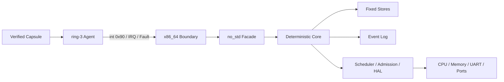

<h1 align="center">AGENT KERNEL</h1>

<p align="center">
  <code>Agent 原生 / Capability 授权 / Event 溯源 / 裸机运行</code>
</p>

<p align="center">
  <a href="README.md">English</a> · <strong>简体中文</strong>
</p>

<p align="center">
  
  
  
  
  
</p>

```text
agent@kernel:~$ scripts/run-qemu.sh --release

[boot]      AGENT_KERNEL_QEMU_BOOT_OK
[ring-3]    AGENT_KERNEL_HETEROGENEOUS_AGENT_EXECUTION_OK
[namespace] AGENT_KERNEL_AGENT_CALL_NAMESPACE_COMPARE_REBIND_OK
[audit]     AGENT_KERNEL_NATIVE_EVENT_ARCHIVE_REPLAY_OK
[event]     396 driver_invocation_completed
[handoff]   SUPERVISOR_HANDOFF_READY
```

Agent Kernel 是一个用 Rust 编写的 Agent 原生操作系统内核。
它直接启动于 x86_64 硬件，并执行隔离的 ring-3 Agent Capsule。

> [!IMPORTANT]
> 项目处于持续内核开发阶段，ABI、设备覆盖与保障模型仍在演进。

[`模型`](#01--内核模型) · [`架构`](#02--架构) ·
[`ABI`](#03--agent-call-abi) · [`验证`](#05--验证档案) ·
[`构建`](#06--构建与启动) · [`路线图`](#08--路线图)

## 00 / 运行系统

| 信号 | 当前参考配置 |
| --- | --- |
| CPU 边界 | BIOS 启动、ring 0 内核、隔离 ring 3 Agent |
| 状态模型 | 固定容量、确定性、无堆 Core Store |
| 权限模型 | 显式 Capability 作用域、派生、收窄、撤销 |
| 审计模型 | 有序 Event、SHA-256 归档链、精确重放 |
| 恢复模型 | Checkpoint、Rollback、故障路由、修复、重启 |
| 原生 I/O | UART IRQ、Port I/O、不可变 HAL 请求、Driver Invocation |

## 01 / 内核模型

```text
AGENT --提交--> CAPABILITY --控制--> RESOURCE
  |                                  |
  +------------- 产生 EVENT <--------+
```

| 原语 | 内核契约 |
| --- | --- |
| `Agent` | 经过认证的权限主体，拥有可调度执行状态 |
| `Capability` | 面向单个 Resource 的显式操作集合，可派生、可撤销 |
| `Intent` | 对目标工作的类型化声明 |
| `Task` | 绑定 Intent 与委托权限的可调度单元 |
| `Verification` | 独立于执行完成的可信状态转换 |
| `Checkpoint` | 受显式 Rollback 权限管理的恢复点 |
| `Event` | 每次成功状态修改产生的确定性证据 |
| `Namespace` | Workspace 内带 revision 的 Key 到对象绑定 |

```text
Observe | Act | Verify | Checkpoint | Rollback | Delegate
```

高权限完整记录于 Capability 与 Event 链中。

## 02 / 架构



| 层 | 职责 |
| --- | --- |
| 内核空间 | 身份、授权、调度、隔离、恢复、审计 |
| 用户空间 | 规划、Prompt、模型运行时、策略、外部适配器 |
| HAL | 接收授权完成后的不可变设备请求 |

LLM 推理位于用户空间。Core 状态转换保持有界、确定性与可重放。

## 03 / Agent Call ABI

Agent Call 通过固定寄存器帧跨越 ring 3。当前 ABI 提供 49 个操作，
用户态指针不会进入调用帧。

```text
rax = magic      rbx = ABI version      rcx = operation / status
r8  = Agent      rdi = Task             rsi = Image
r9  = Nonce      r10..r15, rbp = bounded operation payload
```

| ID | 协议族 |
| ---: | --- |
| `1-9` | 执行、验证、Mailbox IPC |
| `10-20` | Resource、Capability、Task、Agent 生命周期 |
| `21-28` | Runtime Memory 与 Admission |
| `29-43` | 回收、压缩、Event 归档 |
| `44-49` | Namespace 绑定、解析、强制修改、generation 比较 |

### Namespace 协议

| Call | ID | 权限 | 结果 |
| --- | ---: | --- | --- |
| `BindNamespaceEntry` | 44 | `Act` | 分配单调递增的 Entry ID |
| `ResolveNamespaceEntry` | 45 | `Observe` | 返回完整记录并追加审计证据 |
| `RebindNamespaceEntry` | 46 | `Act` | 强制替换对象并推进 revision |
| `RetireNamespaceEntry` | 47 | `Rollback` | 强制稳定删除并归还槽位 |
| `CompareAndRebindNamespaceEntry` | 48 | `Act` | 仅在 revision 匹配时替换 |
| `CompareAndRetireNamespaceEntry` | 49 | `Rollback` | 仅在 revision 匹配时回收 |

保留寄存器非零、对象编码错误、revision 过期、权限不匹配等请求，
都会在状态修改前失败。

<details>
<summary><strong>ABI 不变量</strong></summary>

- 调用身份来源于调度器执行上下文。
- Core 再次检查 Capability 作用域与操作位。
- 事务预检容量、活引用与 Event 槽位。
- 规范回复会清理无关寄存器。
- Capsule、CPU 帧或转录不一致时终止验证。

</details>

## 04 / 已实现运行时

| 子系统 | 原生路径 | QEMU 证据 |
| --- | --- | --- |
| 隔离 | 独立 CR3、GDT/TSS/IDT、特权级切换 | `MULTI_AGENT_ISOLATION_OK` |
| 调度 | FIFO、PIT 抢占、CPU 帧恢复 | `MULTI_AGENT_CONTEXT_SWITCH_OK` |
| 故障 | `#UD`、`#GP`、`#PF`、路由、修复、重启 | `NATIVE_AGENT_FAULT_RESTART_OK` |
| IPC | 阻塞 Mailbox、唤醒、确认、回收 | `NATIVE_MAILBOX_IPC_OK` |
| 内存 | 页/区域分配、First-Fit 复用、清零帧池 | `NATIVE_MEMORY_CONCURRENCY_OK` |
| 管理器 | Resource、Capability、Task、Agent、Memory、Namespace | `NATIVE_RESOURCE_MANAGER_AGENT_OK` |
| Admission | 常驻 Supervisor、Permit、批量释放 | `NATIVE_RUNTIME_ADMISSION_COMMIT_OK` |
| Driver | UART IRQ 经 HAL 请求进入 Invocation | `DRIVER_INVOCATION_FLOW_OK` |
| 审计 | 满 Event Log、归档检查点、SHA-256 重放 | `NATIVE_EVENT_ARCHIVE_REPLAY_OK` |

## 05 / 验证档案

| 指标 | 值 |
| --- | ---: |
| 目标 | `x86_64-unknown-none` |
| 已完成隔离 Agent 上下文 | 11 |
| 内核选择 Dispatch | 35 |
| Resource Manager Calls / CR3 switches | `39 / 78` |
| Admission Supervisor Calls / CR3 switches | `44 / 88` |
| Namespace Store 容量 / 最终占用 | `1 / 1` |
| 实时 Event 容量 / 峰值占用 | `362 / 362` |
| 已归档 Event | 64 |
| 最终实时 Event / 下一序列 | `332 / 397` |
| 完整转录 | Events `1..396` |

| Native Capsule | Calls | 字节 | SHA-256 |
| --- | ---: | ---: | --- |
| Resource Manager | 39 | 3,854 | `a34b39a50168...238be442` |
| Admission Supervisor | 44 | 4,114 | `3acd53283d17...07c6cb42` |

独立汇编结果与 Rust 字节数组逐字节一致。完整 Resource Manager Capsule
及其纯机器码在 Release ELF 中均只出现一次。

<details>
<summary><strong>完整 Capsule 摘要与 Event 窗口</strong></summary>

```text
resource_manager
a34b39a50168bb128d4f4ca1d8a30b02c94087b1d47148215ca57e5e238be442

admission_supervisor
3acd53283d17e77952a5742b895b2f4b578ee768faf497bce070a86397c6cb42

event[186] namespace_entry_bound
event[187] namespace_entry_resolved
event[188] namespace_entry_rebound
event[189] namespace_entry_retired
event[190] namespace_entry_bound
...
event[396] driver_invocation_completed
SUPERVISOR_HANDOFF_READY
```

</details>

## 06 / 构建与启动

**依赖：** 通过 `rustup` 管理的 Rust、仓库固定的 nightly、LLVM tools、
`x86_64-unknown-none` target，以及 `qemu-system-x86_64`。

```bash
git clone https://github.com/Evan-master/agent-kernel.git
cd agent-kernel

cargo test --workspace
cargo run -p agent-supervisor

# 完整裸机转录验证
scripts/run-qemu.sh
scripts/run-qemu.sh --release
```

```bash
# 裸机编译门槛
cargo check \
  -p agent-kernel-x86_64 \
  --features bare-metal \
  --bin agent-kernel-x86_64 \
  --target x86_64-unknown-none
```

## 07 / 仓库地图

```text
crates/
|- agent-kernel-core/    确定性 no_std 模型与 Store
|- agent-kernel/         no_std syscall 风格 Facade
|- agent-kernel-hal/     不可变设备请求协议
|- agent-kernel-boot/    Bootstrap 与容量配置
|- agent-kernel-x86_64/  启动、隔离、IRQ、Fault、Agent Call
|- agent-kernel-image/   BIOS 镜像构建器
`- agent-supervisor/     宿主 Supervisor 与虚拟设备后端

docs/superpowers/
|- specs/                已确认架构记录
`- plans/                里程碑实现计划
```

## 08 / 路线图

| 方向 | 当前 | 下一阶段 |
| --- | --- | --- |
| Namespace | revision compare 修改 | 层级、挂载、有界遍历 |
| Memory | 固定私有页表、页/区域复用 | 动态页表增长 |
| Scheduling | 单核 FIFO 与 PIT | SMP、同步、TLB shootdown |
| Durability | 有界 SHA-256 归档链 | 崩溃一致的签名存储 |
| Devices | UART 与 Port I/O | Storage、Network、Graphics、USB |
| Agent 软件 | 定宽 Capsule | Package 格式与生产加载器 |
| Assurance | 测试、QEMU 转录、ELF 审计 | 安全加固、形式化验证、稳定 ABI |

当前设计记录：
[Native Namespace Generations V2](docs/superpowers/specs/2026-07-20-native-namespace-generations-v2-design.md)。

## 参与贡献

修改代码前请阅读 [`AGENTS.md`](AGENTS.md)。运行时变更需要先写失败测试，
并提供显式权限、确定性 Event 与对应 QEMU 证据。

## 许可证

[MIT](LICENSE) © 2026 Ran
