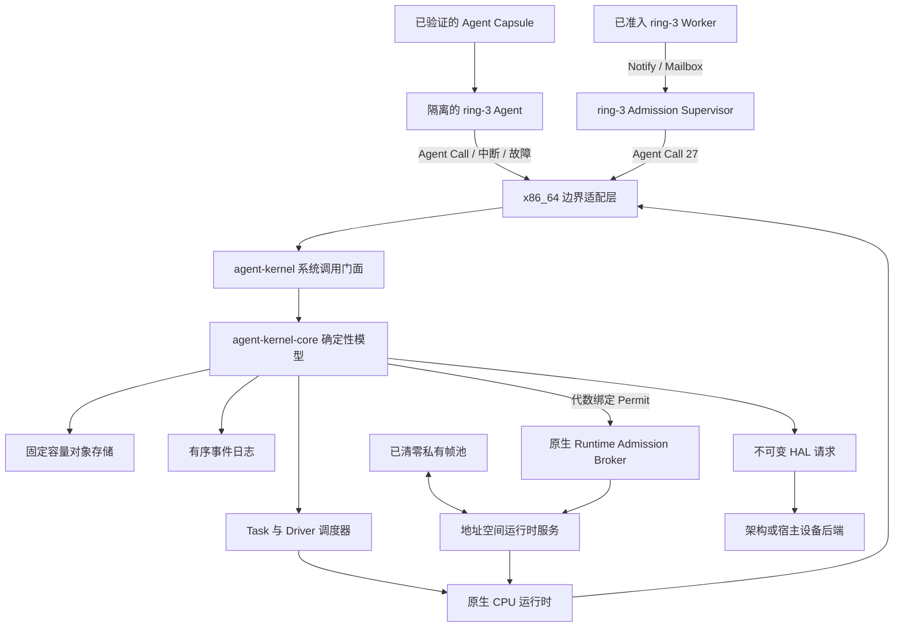

# Agent Kernel

[English](README.md) | **简体中文**

Agent Kernel 是一个用 Rust 编写的 Agent 原生操作系统内核。它以 Agent、资源、
能力、意图、任务、事件、验证和回滚作为主要内核对象，其架构不依赖 Linux、
命令行自动化或 POSIX 兼容层。

> **开发状态：** 项目处于持续内核开发阶段。独立的 x86_64 目标已经能够在
> QEMU 中启动并运行相互隔离的 ring-3 Agent Capsule；ABI 与架构仍在演进，
> 生产级稳定性将在后续阶段建立。

## 系统模型

传统操作系统主要向程序提供进程、文件、套接字和用户等抽象。一个真正以
Agent 为中心的系统需要不同的控制面：

- **Agent** 是内核可见的执行主体和权限主体。
- **资源（Resource）** 是 Agent 可以控制的任何内核对象。
- **能力（Capability）** 明确规定哪个 Agent 能对哪个资源执行哪些操作；
  权限可以收窄、派生和撤销。
- **意图（Intent）** 描述想完成的工作，**任务（Task）** 是可调度执行单元。
- **验证（Verification）** 与“执行成功”分离，成功不自动等于结果可信。
- **检查点（Checkpoint）** 和 **回滚（Rollback）** 是一等生命周期操作。
- 每次成功修改都会生成有序 **事件（Event）**，用于审计与重放。

原生模型中不存在环境式的“默认超级用户”。Agent 可以拥有很高权限，但这些
权限必须由明确的 Capability 表达，并且始终能在事件日志中观察到。

## 当前实现

参考 BIOS/QEMU 配置不依赖 Linux 或其他宿主操作系统作为内核底座，当前包括：

- 永久 GDT、TSS、IDT、ring-0/ring-3 边界和每个 Agent 独立的 CR3 页表根；
- 九个完成执行的隔离原生 Agent 上下文：两个初始 Worker、一个 Verifier、一个
  Fault Worker、一个 Fault Handler、一个 Resource Manager、一个 Admission
  Supervisor，以及两个回收后准入的 Runtime Service Worker；
- 由内核选择的 FIFO 调度、真实 PIT 定时器抢占，以及跨恢复过程完整持有 CPU 帧；
- 由 SHA-256 绑定的定长 Agent Image Capsule，以及 Worker、Verifier、
  FaultHandler、Supervisor 类型化入口；
- 仅使用寄存器、不接受用户态指针的版本化 Agent Call ABI；
- 阻塞式邮箱发送、接收、确认与唤醒，主动 Yield，任务结果、目标限定验证和完成；
- 对 ring-3 `#UD`、`#GP`、`#PF` 的故障隔离；来自内核态的异常仍然直接失败；
- 在提交 `TaskFaulted` 前，对仍存活的私有运行时内存执行有界故障回收：使用精确
  Capability 退休 Resource、移除叶项、清零并归还物理帧、保留固定容量证据，同时
  保持已捕获 CPU 可重启；
- 对通过认证的 `CompleteTask` 使用同一有界事务，先执行只读完成资格预检，再把
  有序回收证据附加到 Completed CPU；
- 为每个原生 Agent 完整记录 4 个私有页表帧和 7 个内容帧，在终态证据核验后
  清零全部地址空间帧，并转移到固定容量可复用池；
- Agent 绑定的原生地址空间运行时服务，将完整 11 帧分配、P4/P3/P2/P1 精确
  重建、CPU 准备和运行时登记纳入同一个事务式准入流程；
- 固定容量 Runtime Admission 对象，支持根作用域 `Delegate` 授权、FIFO 请求准备、
  代数绑定 Permit、有界拒绝原因，以及准入和 Task 入队的原子提交；
- Agent Call 27 与真实 ring-3 Admission Supervisor Capsule，为两个已接受且尚未
  入队的目标 Agent 创建可审计的 Runtime Admission 请求，随后阻塞在 Mailbox，
  并在目标准入和执行期间持续驻留；
- x86 准入 Broker，负责校验 Permit 绑定的 Capsule、驱动既有地址空间服务、
  提交语义准入，并在语义提交无法继续时完整恢复物理运行时事务；
- 受认证的 Worker 完成通知，用于唤醒保留的 Supervisor 调用帧，随后完成两次
  FIFO 接收确认和三个地址空间所有者的终态回收；
- 代数绑定的 Runtime Admission 批量释放 Permit，要求目标 Task 已验证且执行上下文
  空闲，预检聚合事件容量，并在 33 个物理帧全部归还后原子记录两条
  `RuntimeAdmissionReleased` 转换；
- 一次重复运行时登记在完成页表重建后被拒绝，服务清零并原子归还全部 11 帧，
  随后同时持有三个互不重叠的私有地址空间，完成 FIFO ring-3 执行、验证和 33 帧
  终态回收；
- 将缺页故障按策略路由给真实 ring-3 Fault Handler，再通过 Capability
  限定的方式修复保留页，并从同一故障帧继续执行；
- 真实 ring-3 Resource Manager：使用派生的 `Act` 权限创建子 Service，
  将收窄后的 `Observe` 权限派生给另一个 Agent，通过来源的 `Delegate`
  权限撤销这个直接子 Capability，以 `Rollback` 权限退休该 Service，随后声明
  新的 `Act` Intent、创建对应 Task，并向已注册 Agent 委派内核签发的任务能力；
- 同一 ring-3 Capsule 中的原生 Agent Manager 协议：使用根作用域 `Delegate`
  权限注册 Agent 9，再通过四次受认证 Agent Call 依次暂停、恢复和退休这个尚未
  启动的身份；
- 由 16 个物理帧组成的共享运行时池，提供确定性分配、整页清零，以及绑定 Agent、
  Resource、MemoryCell 和分配代数的所有权记录；
- 真实物理内存支撑的兼容页与多页区域生命周期，可分配 1 至 4 页内核选址区域，
  执行 ring-3 首尾页证明写入与检查，支持多个区域同时存活、确定性 First-Fit
  空洞复用，随后移除全部叶项并归还清零后的帧；
- 固定容量的有序区域观察日志，将分配身份和 ring-3 证明值传递到内核终态证据；
- 从 UART 中断、端点解析、不可变 HAL 请求、Port I/O、结果记录到 Driver
  Invocation 完成的内核授权驱动链路。

参考验证配置强制满足以下确定性不变量：

| 证据 | 数量 |
| --- | ---: |
| 注册 Agent | 12 |
| 原生 ring-3 完成上下文 | 9 |
| 内核选择的 Dispatch | 30 |
| Resource Manager Agent Call | 29 |
| Resource Manager Agent/内核地址空间切换 | 58 |
| Admission Supervisor Agent Call | 9 |
| Admission Supervisor Agent/内核地址空间切换 | 18 |
| Runtime Service Worker Agent Call | 8 |
| Runtime Service Worker Agent/内核地址空间切换 | 16 |
| 真实物理时间片到期 | 13 |
| Runtime Admission 请求 | 2 |
| Runtime Admission 提交 | 2 |
| Runtime Admission 释放 | 2 |
| 终态 Released Runtime Admission 记录 | 2 |
| Worker 完成通知 | 2 |
| 常驻 Supervisor Mailbox 等待 | 1 |
| 常驻 Supervisor Mailbox 唤醒 | 1 |
| 被隔离的 Agent 故障 | 4 |
| 故障时回收的存活区域 | 1 |
| 故障时回收的物理帧 | 2 |
| 完成时回收的存活区域 | 1 |
| 完成时回收的物理帧 | 3 |
| 被拒绝的原生准入取消次数 | 1 |
| 准入取消恢复的物理帧 | 11 |
| 原生地址空间回收完成次数 | 9 |
| 私有地址空间帧终态累计归还次数 | 99 |
| 最终已清零私有地址空间帧池 | 66 |
| Resource Manager 执行后的资源 | 7 |
| Runtime Service Worker 验证后的 Capability | 23 |
| Runtime Service Worker 验证后的 Intent | 10 |
| Runtime Service Worker 验证后的 Task | 10 |
| Resource Manager 执行后的 MemoryCell | 5 |
| 已归还并清零的共享运行时帧 | 16 |
| Driver 完成后的有序内核事件 | 275 |

`scripts/run-qemu.sh` 会逐条校验事件顺序，同时拒绝缺失标记、多余事件、异常的
QEMU 退出状态以及任何 fail-closed 启动路径。

## 架构



内核保持小型、确定性和可检查。用户态 Supervisor 负责 LLM 推理、Prompt、
远程模型调用和高级规划；内核空间负责确定性执行与权限原语。

## 工作区结构

| Crate | 职责 |
| --- | --- |
| `agent-kernel-core` | `no_std` AgentOS 对象模型、授权、生命周期、调度与事件 |
| `agent-kernel` | 核心模型之上的 `no_std` 系统调用式门面 |
| `agent-kernel-hal` | 由内核授权的不可变设备请求协议 |
| `agent-kernel-boot` | 确定性 Bootstrap 交接与固定容量配置 |
| `agent-kernel-x86_64` | 裸机 x86_64 启动、隔离、中断、故障、Agent Call 与 QEMU 验证 |
| `agent-kernel-image` | 在宿主机生成 BIOS 磁盘镜像的工具 |
| `agent-supervisor` | 宿主侧用户态模拟器与虚拟设备后端 |

所有内核存储都使用固定容量。核心层和门面层不使用堆分配、宿主文件、Socket、
线程、随机数或隐藏的全局可变状态。

## Agent Call ABI

Agent Call 通过固定寄存器帧跨越 ring-3 边界。任何修改状态的请求在进入门面层
之前，都必须与调度器持有的 Agent、Task、Image 和 Nonce 身份完全匹配。

| 操作 | ID | 用途 |
| --- | ---: | --- |
| `DescribeContext` | 1 | 建立可信执行身份和 Nonce |
| `Yield` | 2 | 主动把正在运行的 Task 放回队列 |
| `CompleteTask` | 3 | 回收存活私有内存并完成已认证的 Task |
| `SubmitTaskResult` | 4 | 保存定宽 Task 结果 |
| `InspectTaskResult` | 5 | 检查一个被授权目标的结果 |
| `VerifyTask` | 6 | 提交目标限定的验证结果 |
| `SendMessage` | 7 | 发送引用类型化内核对象的消息 |
| `ReceiveMessage` | 8 | 接收消息，或原子进入邮箱等待 |
| `AcknowledgeMessage` | 9 | 确认已接收消息 |
| `CreateResource` | 10 | 使用明确的父资源权限创建子资源 |
| `RetireResource` | 11 | 使用资源的 `Rollback` Capability 将其退休 |
| `DeriveCapability` | 12 | 为另一个已注册 Agent 派生收窄后的来源权限 |
| `RevokeDerivedCapability` | 13 | 通过带 `Delegate` 的来源撤销一个直接子 Capability |
| `DeclareIntent` | 14 | 使用明确的资源权限声明类型化工作 |
| `CreateTask` | 15 | 从自身拥有且已声明的 Intent 创建 Task |
| `DelegateTask` | 16 | 委派已创建 Task 并签发任务范围的 Capability |
| `RegisterManagedAgent` | 17 | 在 Resource 管理域中注册尚未启动的 Agent |
| `SuspendManagedAgent` | 18 | 暂停处于静止状态的受管 Agent |
| `ResumeManagedAgent` | 19 | 恢复已暂停的受管 Agent |
| `RetireManagedAgent` | 20 | 提交处于静止状态的受管 Agent 终态 |
| `AllocateMemoryPage` | 21 | 在自身拥有的 Memory Resource 下映射一个内核选址私有页 |
| `InspectMemoryPage` | 22 | 审计并返回映射页中的首个定宽值 |
| `ReleaseMemoryPage` | 23 | 退休 Memory Resource、移除叶项并清零物理帧 |
| `AllocateMemoryRegion` | 24 | 在自身拥有的 Memory Resource 下映射 1 至 4 页内核选址区域 |
| `InspectMemoryRegion` | 25 | 审计并返回区域第一页和最后一页中的首个定宽值 |
| `ReleaseMemoryRegion` | 26 | 退休 Memory Resource、移除全部叶项、清零全部帧并归还区域 |
| `RequestRuntimeAdmission` | 27 | 为一个已接受且尚未入队的目标 Task 请求可审计原生运行时准入 |

原生资源 ABI 当前接受 Workspace、Memory、Service、Network 和 Device。
未知类型、未知操作位、零句柄、过期 Nonce、错误身份或非零保留寄存器都会直接拒绝。
Task Manager ABI 接受五种原生 Intent 类型，以及明确的可选或必需验证策略代码。
Agent 管理要求调用者持有管理 Resource 上活跃、根作用域的 `Delegate`
Capability；目标执行上下文必须空闲，同时没有启动入口和未终结的已分配 Task。
运行时内存调用只接受 Capability、内核对象句柄和有界页数；虚拟地址、物理帧、
访问标志和字节长度均由内核选择。

运行时准入要求通过认证的 Supervisor 入口，以及目标 Task Resource 上活跃、
根作用域的 `Delegate` Capability。内核把请求绑定到目标 Agent、Task、已验证
Image 和 Resource。x86 Broker 只接收经过代数校验的 Permit，并在物理登记成功后
提交队列可见性。

## 快速开始

### 环境要求

- 通过 `rustup` 安装 Rust；
- 仓库指定的 nightly、`rust-src`、LLVM tools 和 `x86_64-unknown-none`
  target。使用 rustup 管理的 Cargo 时，会按 `rust-toolchain.toml` 自动安装；
- 运行独立 x86_64 验证目标所需的 `qemu-system-x86_64`。

macOS 可通过 Homebrew 安装 QEMU：

```bash
brew install qemu
```

### 构建与测试

```bash
git clone https://github.com/Evan-master/agent-kernel.git
cd agent-kernel

cargo fmt --check
cargo test --workspace
cargo run -p agent-supervisor
```

### 运行 x86_64 验证目标

```bash
scripts/run-qemu.sh
scripts/run-qemu.sh --release
```

脚本会构建裸机目标、生成 BIOS 镜像、启动 QEMU、检查完整串口记录、要求恰好
275 个事件，并把内核 debug-exit 状态也作为契约的一部分。成功运行包含以下证明行：

```text
AGENT_KERNEL_NATIVE_FAULT_MEMORY_RECLAIMED_OK
AGENT_KERNEL_NATIVE_COMPLETION_MEMORY_RECLAIMED_OK
AGENT_KERNEL_RUNTIME_FRAME_POOL_RELEASED_OK
AGENT_KERNEL_NATIVE_ADDRESS_SPACE_RECLAIMED_OK
AGENT_KERNEL_NATIVE_ADDRESS_SPACE_FRAME_POOL_OK
AGENT_KERNEL_NATIVE_ADDRESS_SPACE_RUNTIME_CANCEL_OK
AGENT_KERNEL_NATIVE_ADDRESS_SPACE_ALLOCATED_OK
AGENT_KERNEL_NATIVE_ADDRESS_SPACE_REBUILT_OK
AGENT_KERNEL_NATIVE_ADDRESS_SPACE_RUNTIME_BATCH_OK
AGENT_KERNEL_NATIVE_ADDRESS_SPACE_RUNTIME_CONCURRENCY_OK
AGENT_KERNEL_AGENT_CALL_RUNTIME_ADMISSION_REQUEST_OK
AGENT_KERNEL_NATIVE_RUNTIME_ADMISSION_REQUEST_OK
AGENT_KERNEL_NATIVE_RUNTIME_ADMISSION_RESIDENT_WAIT_OK
AGENT_KERNEL_NATIVE_RUNTIME_ADMISSION_NOTIFICATION_OK
AGENT_KERNEL_NATIVE_RUNTIME_ADMISSION_SUPERVISOR_OK
AGENT_KERNEL_NATIVE_RUNTIME_ADMISSION_COMMIT_OK
AGENT_KERNEL_NATIVE_RUNTIME_ADMISSION_RELEASE_OK
AGENT_KERNEL_NATIVE_ADDRESS_SPACE_REUSE_EXECUTION_OK
AGENT_KERNEL_NATIVE_ADDRESS_SPACE_REUSED_RECLAIMED_OK
AGENT_KERNEL_NATIVE_RESOURCE_MANAGER_AGENT_OK
AGENT_KERNEL_NATIVE_CAPABILITY_MANAGER_OK
AGENT_KERNEL_NATIVE_TASK_MANAGER_OK
AGENT_KERNEL_NATIVE_AGENT_MANAGER_OK
AGENT_KERNEL_NATIVE_MEMORY_PAGE_MANAGER_OK
AGENT_KERNEL_NATIVE_MEMORY_REGION_MANAGER_OK
AGENT_KERNEL_NATIVE_MEMORY_CONCURRENCY_OK
AGENT_KERNEL_DRIVER_INVOCATION_FLOW_OK
event[275] driver_invocation_completed
SUPERVISOR_HANDOFF_READY
```

## 权限与失败模型

- 资源访问始终通过明确的 Capability。
- Task 范围的 Capability 不能被悄悄当作通用 Resource 权限。
- 派生权限不能超过来源权限；祖先 Capability 被撤销后，后代权限也失效。
- 架构适配层只能调用公开门面 API，不能直接修改核心存储。
- 多记录修改会先完成容量检查，因此失败保持原子性。
- 已退休对象仍可查询审计，但不能继续作为活跃对象使用。
- Capsule、Agent Call、CPU 帧、事件序列或物理所有权证据不匹配时，系统按
  fail-closed 策略终止验证。

高权限 Agent 的所有广泛权限都保持明确、可组合、可撤销、可审计。

## 已实现与待实现

### 已实现

- Agent、Resource、Capability、Intent、Task、Action、Observation、
  Verification、Checkpoint、Rollback、Message、Fault、Driver、Memory Cell、
  Namespace 和 Event 原语；
- Capability 授予与收窄、Task 委派、来源撤销传播、受认证的直接子权限撤销、
  资源所有权和资源退休；
- 固定容量调度、等待/唤醒、邮箱 IPC、故障策略、镜像验证、语义 Runtime
  Admission 和 Driver Invocation 生命周期；
- 裸机 x86_64 隔离、时钟抢占、故障隔离/恢复，以及原生 Resource、Capability、
  Intent、Task、受管 Agent、共享物理帧池、兼容页和多页内存区域生命周期调用。
- 对故障时仍存活的 Memory Resource 执行确定性退休，移除私有叶项，清零并归还
  帧，保存有界回收证据，并在清理完成后重启 Agent。
- 对通过认证的完成请求使用同一固定容量事务，退休仍存活的 Memory Resource，
  清理私有映射，并把回收证据保留到 Completed CPU。
- 完整记录私有页表与内容帧所有权，在终态回收六个原生地址空间，并把 66 个
  清零后的帧转移到固定容量池；
- 从回收池分配绑定 Agent 和代数的完整 11 帧身份，并由事务式运行时服务负责私有
  页表层级重建、CPU 准备和原生运行时登记；
- ring-3 Admission Supervisor、受认证 Agent Call 27、固定容量准入记录、代数绑定
  Permit，以及连接可审计语义请求和物理运行时服务的 Broker；
- 跨越目标准入和执行阶段的常驻 Supervisor Mailbox 等待、受认证 Worker 通知、
  FIFO 确认和三个地址空间的原子终态回收；
- 使用不透明、代数绑定的批量释放 Permit，把已验证且空闲的 Task 连接到物理回收
  完成后的 `RuntimeAdmissionReleased` 记录和有序内核事件；
- 在页表重建后的准入拒绝路径完成全部帧回滚，并让两个互不重叠的 Runtime Service
  Worker 同时持有地址空间，完成 FIFO ring-3 执行、语义验证和终态回收；
- 为包含 275 个事件的参考配置提供固定 2 MiB 带保护页内核启动栈。

### 后续规划

- 超出固定私有层级的动态页表增长；
- 动态请求者发现、多批次常驻准入循环、有界释放记录压缩，以及超过 Task Store
  容量的准入队列；
- SMP 调度、多核同步和硬件 TLB Shootdown；
- 通用存储、网络、图形、USB 或真实硬件支持；
- 面向分发与升级的 Agent 包和应用格式；
- 生产级用户态 Supervisor、模型运行时和策略规划器；
- POSIX、Linux 或 Windows 兼容层；
- 生产安全加固、形式化验证和稳定 ABI 承诺。

最新里程碑的完整契约见 [Runtime Admission Release 设计](docs/superpowers/specs/2026-07-19-runtime-admission-release-v1-design.md)
和 [实现计划](docs/superpowers/plans/2026-07-19-runtime-admission-release-v1.md)。
历史设计记录保留在 `docs/superpowers/specs/`。

## 参与贡献

修改代码前请阅读 [AGENTS.md](AGENTS.md)。提交内容必须保持既有内核架构和验证
契约，尤其注意：

- 核心模型保持 Agent 原生，POSIX 支持限定在兼容层；
- 保持 `no_std`、确定性、固定容量存储和明确事件；
- 新运行时行为必须先写失败测试；
- 所有特权修改都经过明确的 Capability 检查；
- 发布前运行工作区测试、Supervisor 和相关 QEMU 验证。

## 许可证

[MIT](LICENSE)
