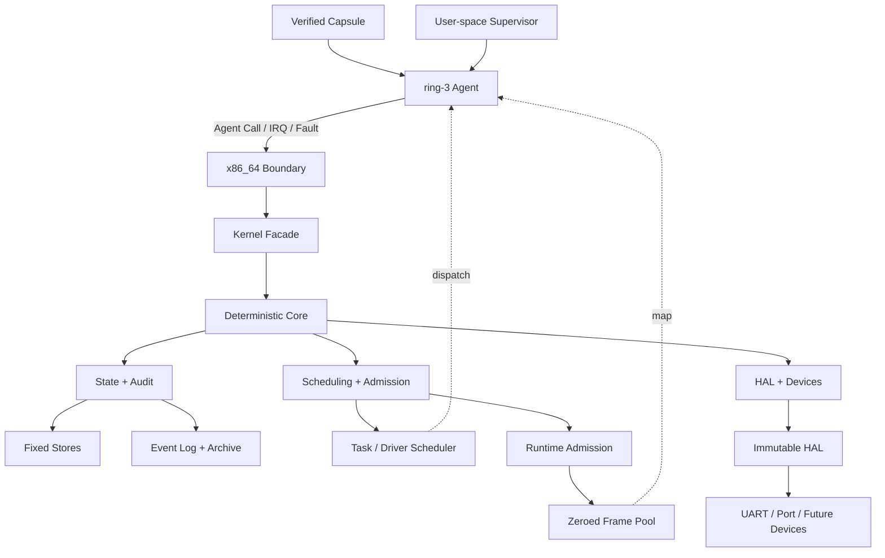

<h1 align="center">Agent Kernel</h1>

<p align="center">
  <strong>Agent 原生 · Capability 授权 · Event 驱动 · Rust 裸机内核</strong>
</p>

<p align="center">
  <a href="README.md">English</a> · <strong>简体中文</strong>
</p>

<p align="center">
  
  
  
  
</p>

```text
AGENT
  |
CAPABILITY
  `- explicit authority
  |
RESOURCE
  |
EVENT
  |- deterministic evidence
  `- replayable / auditable
```

Agent Kernel 是一个用 Rust 编写的 Agent 原生操作系统内核。

它直接在 x86_64 虚拟硬件上启动，以 Agent、Capability、Intent、Task、
Verification、Rollback 与 Event 作为核心系统对象。

> [!IMPORTANT]
> 项目处于持续内核开发阶段。QEMU 参考目标已运行隔离 ring-3 Agent Capsule；
> ABI、硬件覆盖和生产级安全仍在演进。

```console
$ scripts/run-qemu.sh --release
AGENT_KERNEL_QEMU_BOOT_OK
AGENT_KERNEL_NATIVE_NAMESPACE_MANAGER_OK
AGENT_KERNEL_NATIVE_EVENT_ARCHIVE_REPLAY_OK
event[396] driver_invocation_completed
SUPERVISOR_HANDOFF_READY
```

## 导航

[内核契约](#内核契约) · [运行能力](#运行能力) · [架构](#架构) ·
[Agent Call ABI](#agent-call-abi) · [验证档案](#验证档案) ·
[快速开始](#快速开始) · [路线图](#路线图)

## 内核契约

| 对象 | 内核语义 |
| --- | --- |
| `Agent` | 可执行、可调度、可认证的权限主体 |
| `Resource` | Workspace、Memory、Service、Network、Device 等受控对象 |
| `Capability` | Agent 对特定 Resource 的显式操作集合，可收窄、派生、撤销 |
| `Intent` | 期望完成的类型化工作声明 |
| `Task` | 由 Intent 创建并进入调度生命周期的执行单元 |
| `Verification` | 独立于执行结果的可信确认步骤 |
| `Checkpoint / Rollback` | 一等恢复与清理权限 |
| `Event` | 每次成功修改产生的有序、确定性审计记录 |
| `Namespace` | 将定宽 Key 绑定到类型化内核对象的 Workspace 目录 |

```text
Observe  Act  Verify  Checkpoint  Rollback  Delegate
   |      |      |        |           |          |
   +------+------+- Capability ------+----------+
```

内核没有环境式超级用户。高权限通过明确 Capability 表达，并进入审计链。

## 运行能力

| 子系统 | 当前能力 | QEMU 证据 |
| --- | --- | --- |
| 启动与特权 | BIOS 启动、GDT、TSS、IDT、ring-0/ring-3 调用门 | `AGENT_KERNEL_GDT_TSS_OK` |
| 隔离与调度 | 每 Agent 独立 CR3、FIFO 调度、PIT 抢占、CPU 帧恢复 | `AGENT_KERNEL_MULTI_AGENT_CONTEXT_SWITCH_OK` |
| Agent 执行 | SHA-256 Capsule、类型化入口、11 个完成上下文 | `AGENT_KERNEL_HETEROGENEOUS_AGENT_EXECUTION_OK` |
| 内存 | 私有页表、按页/区域分配、First-Fit 复用、清零帧池 | `AGENT_KERNEL_NATIVE_MEMORY_CONCURRENCY_OK` |
| 故障 | ring-3 `#UD`、`#GP`、`#PF` 隔离、路由、修复、恢复 | `AGENT_KERNEL_NATIVE_AGENT_FAULT_RESTART_OK` |
| IPC | 阻塞 Mailbox、唤醒、确认、Message 回收 | `AGENT_KERNEL_NATIVE_MAILBOX_IPC_OK` |
| 管理器 | Resource、Capability、Task、Agent、Memory、Namespace | `AGENT_KERNEL_NATIVE_RESOURCE_MANAGER_AGENT_OK` |
| Runtime Admission | Permit、Broker、批量释放、地址空间重建 | `AGENT_KERNEL_NATIVE_RUNTIME_ADMISSION_COMMIT_OK` |
| Driver | UART IRQ、Endpoint、HAL 请求、Port I/O、Invocation | `AGENT_KERNEL_DRIVER_INVOCATION_FLOW_OK` |
| 审计 | 固定容量 Event Log、SHA-256 归档链、精确重放 | `AGENT_KERNEL_NATIVE_EVENT_ARCHIVE_REPLAY_OK` |

所有 Core Store 均为固定容量。`agent-kernel-core` 与 `agent-kernel` 保持
`no_std`、无堆分配、无宿主 I/O、无隐藏全局可变状态。

## 架构



### 边界

| 层 | 职责 |
| --- | --- |
| 内核空间 | 身份、授权、调度、隔离、回收、确定性状态转换、审计 |
| 用户空间 | LLM 推理、Prompt、规划、策略、模型运行时、外部服务适配 |
| HAL | 接收经过内核授权的不可变设备请求 |

## Agent Call ABI

Agent Call 使用固定寄存器帧，当前版本提供 47 个操作。

```text
rax = magic     rbx = ABI version     rcx = operation / status
r8  = Agent     rdi = Task            rsi = Image
r9  = Nonce     r10..r15, rbp = bounded operation payload
```

用户态指针不会进入 ABI。修改请求必须匹配调度器持有的 Agent、Task、Image 与
Nonce；保留寄存器必须为零。

| ID 范围 | 协议族 | 主要操作 |
| ---: | --- | --- |
| `1-9` | Execution / IPC | Context、Yield、Result、Verify、Mailbox、Complete |
| `10-16` | Resource / Work | Resource、Capability、Intent、Task、Delegation |
| `17-20` | Agent Manager | Register、Suspend、Resume、Retire |
| `21-26` | Runtime Memory | Page 与 Region 的 Allocate、Inspect、Release |
| `27-28` | Runtime Admission | Request 与可信 requester discovery |
| `29-43` | Lifecycle / Archive | Store 回收、Event 归档、清理撤销 |
| `44-47` | Namespace Manager | Bind、Resolve、Rebind、Retire |

### Namespace Calls

| Call | ID | 权限 | 结果 |
| --- | ---: | --- | --- |
| `BindNamespaceEntry` | 44 | `Act` | 创建单调 Entry ID，返回完整记录 |
| `ResolveNamespaceEntry` | 45 | `Observe` | 返回完整记录并生成审计 Event |
| `RebindNamespaceEntry` | 46 | `Act` | 替换类型化对象并推进 revision |
| `RetireNamespaceEntry` | 47 | `Rollback` | 稳定稠密删除并归还槽位 |

对象编码为 `(object_id << 3) | tag`，支持 Agent、Resource、Task、Message 与
MemoryCell。零 ID、保留 Tag、超宽 ID 和非零保留寄存器均会触发拒绝，且不修改状态。

<details>
<summary><strong>ABI 核心不变量</strong></summary>

- 调用身份来源于调度器上下文。
- Capability 作用域和操作位在 Core 中再次校验。
- 多记录事务先预检容量与活引用。
- 每次成功修改生成 Event。
- 规范回复会清理无关寄存器。
- Capsule、CPU 帧或证据不一致时终止验证流程。

</details>

## 验证档案

### Reference Profile

| 指标 | 值 |
| --- | ---: |
| 架构 | `x86_64-unknown-none` |
| 完成的隔离 Agent 上下文 | 11 |
| 内核选择 Dispatch | 35 |
| Resource Manager Calls / CR3 switches | `39 / 78` |
| Admission Supervisor Calls / CR3 switches | `44 / 88` |
| Namespace Store 容量 / 最终占用 | `1 / 1` |
| 实时 Event 容量 / 归档前占用 | `362 / 362` |
| 归档 Event | 64 |
| 最终实时 Event / 下一序列 | `332 / 397` |
| 完整转录 | Event `1..396` |
| 已归还并清零的私有地址空间帧 | 66 |
| 已归还并清零的共享运行时帧 | 16 |

### Native Capsules

| Capsule | Calls | Switches | Bytes |
| --- | ---: | ---: | ---: |
| Resource Manager | 39 | 78 | 3,848 |
| Admission Supervisor | 44 | 88 | 4,114 |

Rust 数组与独立汇编机器码逐字节一致；每个完整 Capsule 在 Release ELF 中只出现一次。

<details>
<summary><strong>查看完整 Capsule 摘要</strong></summary>

```text
resource_manager
8914b2dc4f1a1c5d93d6d7315ee5e289579fdbeee543b70f121abcce2a8bced6

admission_supervisor
3acd53283d17e77952a5742b895b2f4b578ee768faf497bce070a86397c6cb42
```

</details>

<details>
<summary><strong>查看关键 Event 窗口</strong></summary>

```text
event[186] namespace_entry_bound
event[187] namespace_entry_resolved
event[188] namespace_entry_rebound
event[189] namespace_entry_retired
event[190] namespace_entry_bound
...
event[363] resource_record_retired
event[368] memory_cell_record_retired
event[396] driver_invocation_completed
SUPERVISOR_HANDOFF_READY
```

`scripts/run-qemu.sh` 会检查全部 396 条 Event 的编号、类型、顺序、标记计数与
QEMU debug-exit 状态。

</details>

## 快速开始

### 依赖

- 通过 `rustup` 管理的 Rust；
- 仓库固定的 nightly、`rust-src`、LLVM tools、`x86_64-unknown-none`；
- `qemu-system-x86_64`。

```bash
# macOS
brew install qemu
```

### 构建与测试

```bash
git clone https://github.com/Evan-master/agent-kernel.git
cd agent-kernel

cargo fmt --all -- --check
cargo test --workspace
cargo run -p agent-supervisor
```

### 启动裸机目标

```bash
# Debug
scripts/run-qemu.sh

# Release + 完整转录验证
scripts/run-qemu.sh --release
```

### 裸机编译检查

```bash
cargo check \
  -p agent-kernel-x86_64 \
  --features bare-metal \
  --bin agent-kernel-x86_64 \
  --target x86_64-unknown-none
```

## 工作区

```text
crates/
|- agent-kernel-core/    no_std 对象模型、授权、生命周期、调度、Event
|- agent-kernel/         no_std syscall 风格门面
|- agent-kernel-hal/     不可变设备请求协议
|- agent-kernel-boot/    Bootstrap 与固定容量配置
|- agent-kernel-x86_64/  裸机启动、隔离、IRQ、Fault、Agent Call
|- agent-kernel-image/   BIOS 镜像构建工具
`- agent-supervisor/     宿主侧 Supervisor 与虚拟设备后端
```

## 安全与失败模型

- Resource 访问始终经过明确 Capability。
- Task 作用域权限无法升级为通用 Resource 权限。
- 派生权限不能超过来源权限；祖先撤销会使后代失效。
- 架构层只通过公开 Facade 修改 Core。
- 容量、授权、活引用与 Event 槽位在事务修改前完成检查。
- 畸形 Capsule、调用帧、事件序列和物理所有权证据触发 fail-closed。

## 路线图

| 领域 | 当前状态 | 下一阶段 |
| --- | --- | --- |
| Core 模型 | AgentOS 对象、Capability、Event、Rollback | 分层 Namespace、并发 revision 协议 |
| 内存 | 固定私有页表、页/区域、帧回收 | 动态页表增长、通用映射服务 |
| 调度 | 单核 FIFO、PIT 抢占 | SMP、同步原语、TLB shootdown |
| 持久性 | 有界 Event 归档与 SHA-256 链 | 崩溃一致存储、签名回执、透明日志 |
| 设备 | UART、Port I/O、HAL Driver 链 | Storage、Network、Graphics、USB |
| Agent 软件 | 定宽 Capsule | Package 格式、加载器、生产 Supervisor |
| 兼容层 | 延后 | 独立的 POSIX/Linux/Windows 子系统 |
| 保障 | 测试与可重放证据 | 安全加固、形式化验证、稳定 ABI |

完整 Agent Kernel 目标持续推进。当前里程碑：

- [Native Namespace Manager V1 设计](docs/superpowers/specs/2026-07-20-native-namespace-manager-v1-design.md)
- [Native Namespace Manager V1 实现计划](docs/superpowers/plans/2026-07-20-native-namespace-manager-v1.md)
- [全部设计记录](docs/superpowers/specs/)

## 参与贡献

提交代码前请阅读 [AGENTS.md](AGENTS.md)。核心要求：

1. 保持 Agent 原生系统模型和显式权限边界。
2. Core 与 Facade 保持 `no_std`、固定容量和确定性。
3. 新运行时行为先添加失败测试。
4. 发布前运行 Workspace、Supervisor 与相关 QEMU 验证。

## 许可证

[MIT](LICENSE) © 2026 Ran
