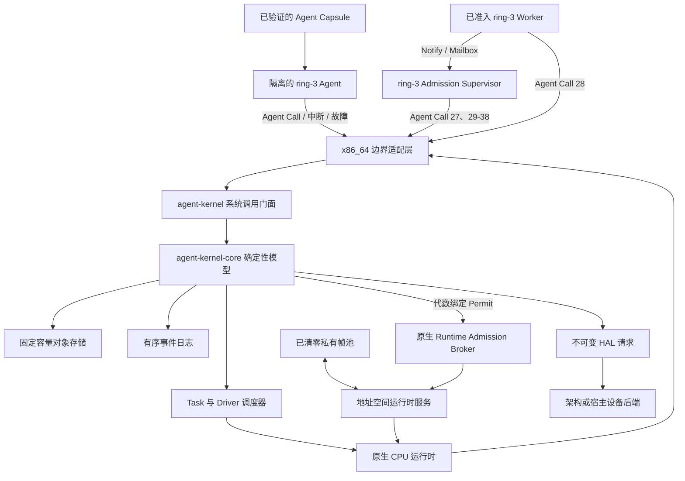

# Agent Kernel

[English](README.md) | **简体中文**

Agent Kernel 是一个用 Rust 编写的 Agent 原生操作系统内核。它以 Agent、资源、
能力、意图、任务、事件、验证和回滚作为主要内核对象，其架构不依赖 Linux、
命令行自动化或 POSIX 兼容层。

> **开发状态：** 项目处于持续内核开发阶段。独立的 x86_64 目标已经能够在
> QEMU 中启动并运行相互隔离的 ring-3 Agent Capsule；ABI 与架构仍在演进，
> 生产级稳定性将在后续阶段建立。

## 系统模型

传统操作系统主要向程序提供进程、文件、套接字和用户等抽象。一个真正以
Agent 为中心的系统需要不同的控制面：

- **Agent** 是内核可见的执行主体和权限主体。
- **资源（Resource）** 是 Agent 可以控制的任何内核对象。
- **能力（Capability）** 明确规定哪个 Agent 能对哪个资源执行哪些操作；
  权限可以收窄、派生和撤销。
- **意图（Intent）** 描述想完成的工作，**任务（Task）** 是可调度执行单元。
- **验证（Verification）** 与“执行成功”分离，成功不自动等于结果可信。
- **检查点（Checkpoint）** 和 **回滚（Rollback）** 是一等生命周期操作。
- 每次成功修改都会生成有序 **事件（Event）**，用于审计与重放。

原生模型中不存在环境式的“默认超级用户”。Agent 可以拥有很高权限，但这些
权限必须由明确的 Capability 表达，并且始终能在事件日志中观察到。

## 当前实现

参考 BIOS/QEMU 配置不依赖 Linux 或其他宿主操作系统作为内核底座，当前包括：

- 永久 GDT、TSS、IDT、ring-0/ring-3 边界和每个 Agent 独立的 CR3 页表根；
- 十一个完成执行的隔离原生 Agent 上下文：两个初始 Worker、一个 Verifier、一个
  Fault Worker、一个 Fault Handler、一个 Resource Manager、一个 Admission
  Supervisor，以及分两批执行的四个回收后准入 Runtime Service Worker；
- 由内核选择的 FIFO 调度、真实 PIT 定时器抢占，以及跨恢复过程完整持有 CPU 帧；
- 由 SHA-256 绑定的定长 Agent Image Capsule，以及 Worker、Verifier、
  FaultHandler、Supervisor 类型化入口；
- 仅使用寄存器、不接受用户态指针的版本化 Agent Call ABI；
- 阻塞式邮箱发送、接收、确认、接收方所有的已确认 Message 回收、管理员负责的孤立
  Message 回收与唤醒，主动 Yield、任务结果、目标限定验证和完成；
- 对 ring-3 `#UD`、`#GP`、`#PF` 的故障隔离；来自内核态的异常仍然直接失败；
- 在提交 `TaskFaulted` 前，对仍存活的私有运行时内存执行有界故障回收：使用精确
  Capability 退休 Resource、移除叶项、清零并归还物理帧、保留固定容量证据，同时
  保持已捕获 CPU 可重启；
- 对通过认证的 `CompleteTask` 使用同一有界事务，先执行只读完成资格预检，再把
  有序回收证据附加到 Completed CPU；
- 为每个原生 Agent 完整记录 4 个私有页表帧和 7 个内容帧，在终态证据核验后
  清零全部地址空间帧，并转移到固定容量可复用池；
- Agent 绑定的原生地址空间运行时服务，将完整 11 帧分配、P4/P3/P2/P1 精确
  重建、CPU 准备和运行时登记纳入同一个事务式准入流程；
- 固定容量 Runtime Admission 对象，支持根作用域 `Delegate` 授权、FIFO 请求准备、
  代数绑定 Permit、有界拒绝原因，以及准入和 Task 入队的原子提交；
- 独立配置的 Runtime Admission 容量，默认跟随 Task 容量以保持源码兼容；x86
  参考配置为 12 个 Task 提供 16 个 Admission 槽位，终态拒绝记录允许使用单调
  递增 ID 重试，并保留历史证据直至压缩；
- Agent Call 27 与真实 ring-3 Admission Supervisor Capsule，分两轮创建四条可审计
  Runtime Admission 请求，两次阻塞在 Mailbox，并在两个批次期间持续持有同一个
  CPU 与地址空间上下文；
- Agent Call 28，仅向准入上下文返回 Permit 绑定的 requester；每个 Runtime
  Service Worker 都会校验回复，并把该身份作为完成通知收件人；
- Agent Call 29，允许通过认证的 Supervisor 压缩已授权的终态 Runtime Admission
  前缀、归还活跃容量、使旧 Permit 失效，并为每条退休记录生成有序审计事件；
- Agent Call 30，允许通过认证的 Supervisor 压缩已授权的终态 Task 前缀，拒绝仍有
  活跃引用的目标，保持 Task ID 单调增长，使旧 Dispatch Permit 失效，并为每个
  回收 Task 生成有序审计事件；
- Agent Call 31，允许通过认证的 Supervisor 在 Task 与未确认 Message 引用清除后
  压缩已授权的终态 Intent 前缀，保持 Intent ID 单调增长，并为每个回收 Intent
  生成有序审计事件；
- Agent Call 32，允许通过认证的 Supervisor 回收单个已撤销 Capability 叶节点；
  内核会先检查子 Capability、Task、Agent Entry、Runtime Admission 和未确认
  Message 引用，退休子 Resource 上的记录可由活跃祖先 `Rollback` 权限清理；
- Agent Call 33，允许通过认证的 Supervisor 回收一个静止的终态 Agent Entry；
  目标原生运行时上下文与全部实时内核引用必须已经清除，稠密 Entry Store 按确定
  顺序左移，同时保留 Agent 身份、终态 Task、委托 Capability、Image 和审计历史；
- Agent Call 34，允许通过认证的接收方回收一条已确认 Message，归还稠密 Store
  槽位，保持其余 FIFO 顺序与 Message ID 单调增长，并生成包含种类和完整 payload
  引用的审计事件；
- Agent Call 35，允许通过认证的管理员使用精确、根作用域的 `Delegate` 权限，回收
  一条发往已退休受管 Agent 的 Pending Message，归还稠密 Store 槽位，并生成包含
  接收方、授权、种类和完整 payload 的审计证据；
- Agent Call 36，允许通过认证的管理员在全部实时非 Event 引用清除后，成对回收一条
  终态受管 Agent 记录及其同索引执行上下文；单调退休高水位阻止历史 Agent 身份再次
  注册；
- Agent Call 37，允许通过认证的 Supervisor 使用根作用域 `Rollback` 清理权限回收
  一条终态 Agent Image 记录；Agent Entry、Runtime Admission 与原生执行上下文中的
  全部引用必须先清除，稳定稠密删除归还 Image Store 容量，单调 Image ID 保持历史
  身份唯一；
- Agent Call 38，允许通过认证的 Supervisor 使用共享 `Rollback` 清理权限压缩连续
  非活跃 Waiter 前缀、归还稠密 Store 容量、保持 Waiter ID 单调增长，并为每条回收
  Waiter 生成完整审计事件；
- x86 准入 Broker，负责校验 Permit 绑定的 Capsule、驱动既有地址空间服务、
  提交语义准入，并在语义提交无法继续时完整恢复物理运行时事务；
- 四条受认证 Worker 完成通知，分两轮唤醒保留的 Supervisor 调用帧，并完成 FIFO
  接收、确认与回收；Message 4 至 7 在两个批次间复用两个瞬时槽位；
- 三槽 x86 Waiter Store 容量证明：Supervisor 在第一轮通知结束后回收 Waiter 1
  至 3，第二轮使用已归还槽位创建单调递增的 Waiter 4，随后回收该记录并使活跃
  Store 归零；
- 两个代数绑定 Runtime Admission 批量释放 Permit，要求目标 Task 已验证且执行上下文
  空闲，并预检聚合事件容量：第一批归还 22 帧且 Supervisor 保留 11 帧；Supervisor
  随后压缩已释放的 Admission 1 和 2，终态批次归还最后 33 帧，并保留已释放的
  Admission 3 和 4；
- 一次重复运行时登记在完成页表重建后被拒绝，服务清零并原子归还全部 11 帧；后续
  跨批次物理复用让 Agent 13 与 14 精确取得 Agent 11 与 10 释放的清零身份，同时
  Supervisor 身份持续驻留并保持互斥；
- 将缺页故障按策略路由给真实 ring-3 Fault Handler，再通过 Capability
  限定的方式修复保留页，并从同一故障帧继续执行；
- 真实 ring-3 Resource Manager：使用派生的 `Act` 权限创建子 Service，
  将收窄后的 `Observe` 权限派生给另一个 Agent，通过来源的 `Delegate`
  权限撤销这个直接子 Capability，以 `Rollback` 权限退休该 Service，随后声明
  新的 `Act` Intent、创建对应 Task，并向已注册 Agent 委派内核签发的任务能力；
- 同一 ring-3 Capsule 中的原生 Agent Manager 协议：使用根作用域 `Delegate`
  权限注册 Agent 9、发送 Pending Message 3、依次暂停、恢复和退休这个尚未启动的
  身份，随后通过 Agent Call 35 回收孤立 Message，通过 Agent Call 36 成对回收
  Agent 9 的记录与执行上下文，并把 Agent 15 注册到已释放槽位；
- 原生 Agent Image Manager 协议：通过 Agent Call 37 回收一次性 Worker Image 9，
  校验完整删除证据，随后把 Image 15 注册到已归还的物理槽位；最终稠密 Store 保留
  ID 1 至 8 与 10 至 15，证明身份持续单调增长；
- 由 16 个物理帧组成的共享运行时池，提供确定性分配、整页清零，以及绑定 Agent、
  Resource、MemoryCell 和分配代数的所有权记录；
- 真实物理内存支撑的兼容页与多页区域生命周期，可分配 1 至 4 页内核选址区域，
  执行 ring-3 首尾页证明写入与检查，支持多个区域同时存活、确定性 First-Fit
  空洞复用，随后移除全部叶项并归还清零后的帧；
- 固定容量的有序区域观察日志，将分配身份和 ring-3 证明值传递到内核终态证据；
- 从 UART 中断、端点解析、不可变 HAL 请求、Port I/O、结果记录到 Driver
  Invocation 完成的内核授权驱动链路。

参考验证配置强制满足以下确定性不变量：

| 证据 | 数量 |
| --- | ---: |
| Agent 注册事件 | 15 |
| 最终驻留 Agent 记录 | 14 |
| 已回收 Agent 记录/上下文对 | 1 |
| 已复用 Agent 记录/上下文槽位 | 1 |
| Agent 记录回收事件 | 1 |
| Agent 退休高水位 | 9 |
| Agent Image 注册事件 | 15 |
| 最终驻留 Agent Image 记录 | 14 |
| 已回收 Agent Image 记录 | 1 |
| 已复用 Agent Image 记录槽位 | 1 |
| Agent Image 记录回收事件 | 1 |
| 原生 ring-3 完成上下文 | 11 |
| 内核选择的 Dispatch | 35 |
| Resource Manager Agent Call | 34 |
| Resource Manager Agent/内核地址空间切换 | 68 |
| Admission Supervisor Agent Call | 32 |
| Admission Supervisor Agent/内核地址空间切换 | 64 |
| Runtime Service Worker Agent Call | 20 |
| Runtime Service Worker Agent/内核地址空间切换 | 40 |
| 真实物理时间片到期 | 15 |
| Task Store 容量 | 12 |
| 已回收终态 Task | 6 |
| 前缀回收后的活跃 Task | 6 |
| Task 回收事件 | 6 |
| Intent Store 容量 | 12 |
| 已回收终态 Intent | 6 |
| 前缀回收后的活跃 Intent | 6 |
| Intent 回收事件 | 6 |
| Agent Entry Store 容量 | 14 |
| 已回收 Agent Entry 记录 | 2 |
| 回收后的活跃 Agent Entry 记录 | 11 |
| Agent Entry 回收事件 | 2 |
| Runtime Admission Store 容量 | 16 |
| Runtime Admission 请求 | 4 |
| Runtime Admission 提交 | 4 |
| Runtime Admission requester discovery | 4 |
| Runtime Admission 释放 | 4 |
| Runtime Admission 压缩事件 | 2 |
| 保留的终态 Runtime Admission 记录 | 2 |
| Worker 完成通知 | 4 |
| Message Store 容量 | 4 |
| 保留的已确认启动流程 Message | 2 |
| 已回收完成通知 Message | 4 |
| 接收方发起的 Message 回收事件 | 4 |
| 管理员发起的孤立 Message 回收事件 | 1 |
| 常驻 Supervisor Mailbox 等待 | 2 |
| 常驻 Supervisor Mailbox 唤醒 | 2 |
| Waiter Store 容量 | 3 |
| 已压缩非活跃 Waiter 记录 | 4 |
| Waiter 压缩事件 | 4 |
| 已复用 Waiter 槽位 | 1 |
| 最终驻留 Waiter 记录 | 0 |
| 被隔离的 Agent 故障 | 4 |
| 故障时回收的存活区域 | 1 |
| 故障时回收的物理帧 | 2 |
| 完成时回收的存活区域 | 1 |
| 完成时回收的物理帧 | 3 |
| 被拒绝的原生准入取消次数 | 1 |
| 准入取消恢复的物理帧 | 11 |
| 原生地址空间回收完成次数 | 11 |
| 私有地址空间帧终态累计归还次数 | 121 |
| 最终已清零私有地址空间帧池 | 66 |
| Resource Manager 执行后的资源 | 7 |
| Capability Store 容量 | 26 |
| 清理与复用后的已占用 Capability 槽位 | 26 |
| 已清理 Capability 记录 | 2 |
| 已复用 Capability 槽位 | 2 |
| Resource Manager 执行后的 MemoryCell | 5 |
| 已归还并清零的共享运行时帧 | 16 |
| Driver 完成后的有序内核事件 | 374 |

`scripts/run-qemu.sh` 会逐条校验事件顺序，同时拒绝缺失标记、多余事件、异常的
QEMU 退出状态以及任何 fail-closed 启动路径。

两个常驻 Supervisor Capsule 同时作为独立二进制工件冻结：

| Capsule | Agent Call | 地址空间切换 | Capsule 字节数 | SHA-256 |
| --- | ---: | ---: | ---: | --- |
| Resource Manager | 34 | 68 | 3,195 | `d86e0918da3eb102ba24d382812c60cf005829888b508817bbd51ea34925af9e` |
| Admission Supervisor | 32 | 64 | 3,034 | `2175ce2b538a6236ce944b4599feacb49e529f6c939d53ae2c5978d26d580ff7` |

生成的 Rust 字节与独立汇编产物完全一致，每个完整 Capsule 在 release ELF 中恰好
出现一次。

## 架构



内核保持小型、确定性和可检查。用户态 Supervisor 负责 LLM 推理、Prompt、
远程模型调用和高级规划；内核空间负责确定性执行与权限原语。

## 工作区结构

| Crate | 职责 |
| --- | --- |
| `agent-kernel-core` | `no_std` AgentOS 对象模型、授权、生命周期、调度与事件 |
| `agent-kernel` | 核心模型之上的 `no_std` 系统调用式门面 |
| `agent-kernel-hal` | 由内核授权的不可变设备请求协议 |
| `agent-kernel-boot` | 确定性 Bootstrap 交接与固定容量配置 |
| `agent-kernel-x86_64` | 裸机 x86_64 启动、隔离、中断、故障、Agent Call 与 QEMU 验证 |
| `agent-kernel-image` | 在宿主机生成 BIOS 磁盘镜像的工具 |
| `agent-supervisor` | 宿主侧用户态模拟器与虚拟设备后端 |

所有内核存储都使用固定容量。核心层和门面层不使用堆分配、宿主文件、Socket、
线程、随机数或隐藏的全局可变状态。

## Agent Call ABI

Agent Call 通过固定寄存器帧跨越 ring-3 边界。任何修改状态的请求在进入门面层
之前，都必须与调度器持有的 Agent、Task、Image 和 Nonce 身份完全匹配。

| 操作 | ID | 用途 |
| --- | ---: | --- |
| `DescribeContext` | 1 | 建立可信执行身份和 Nonce |
| `Yield` | 2 | 主动把正在运行的 Task 放回队列 |
| `CompleteTask` | 3 | 回收存活私有内存并完成已认证的 Task |
| `SubmitTaskResult` | 4 | 保存定宽 Task 结果 |
| `InspectTaskResult` | 5 | 检查一个被授权目标的结果 |
| `VerifyTask` | 6 | 提交目标限定的验证结果 |
| `SendMessage` | 7 | 发送引用类型化内核对象的消息 |
| `ReceiveMessage` | 8 | 接收消息，或原子进入邮箱等待 |
| `AcknowledgeMessage` | 9 | 确认已接收消息 |
| `CreateResource` | 10 | 使用明确的父资源权限创建子资源 |
| `RetireResource` | 11 | 使用资源的 `Rollback` Capability 将其退休 |
| `DeriveCapability` | 12 | 为另一个已注册 Agent 派生收窄后的来源权限 |
| `RevokeDerivedCapability` | 13 | 通过带 `Delegate` 的来源撤销一个直接子 Capability |
| `DeclareIntent` | 14 | 使用明确的资源权限声明类型化工作 |
| `CreateTask` | 15 | 从自身拥有且已声明的 Intent 创建 Task |
| `DelegateTask` | 16 | 委派已创建 Task 并签发任务范围的 Capability |
| `RegisterManagedAgent` | 17 | 在 Resource 管理域中注册尚未启动的 Agent |
| `SuspendManagedAgent` | 18 | 暂停处于静止状态的受管 Agent |
| `ResumeManagedAgent` | 19 | 恢复已暂停的受管 Agent |
| `RetireManagedAgent` | 20 | 提交处于静止状态的受管 Agent 终态 |
| `AllocateMemoryPage` | 21 | 在自身拥有的 Memory Resource 下映射一个内核选址私有页 |
| `InspectMemoryPage` | 22 | 审计并返回映射页中的首个定宽值 |
| `ReleaseMemoryPage` | 23 | 退休 Memory Resource、移除叶项并清零物理帧 |
| `AllocateMemoryRegion` | 24 | 在自身拥有的 Memory Resource 下映射 1 至 4 页内核选址区域 |
| `InspectMemoryRegion` | 25 | 审计并返回区域第一页和最后一页中的首个定宽值 |
| `ReleaseMemoryRegion` | 26 | 退休 Memory Resource、移除全部叶项、清零全部帧并归还区域 |
| `RequestRuntimeAdmission` | 27 | 为一个已接受且尚未入队的目标 Task 请求可审计原生运行时准入 |
| `DiscoverRuntimeAdmission` | 28 | 返回绑定到当前准入上下文的内核可信 requester |
| `CompactRuntimeAdmissions` | 29 | 从活跃准入队列退休已授权的连续终态前缀 |
| `CompactTasks` | 30 | 从活跃 Task Store 退休已授权的连续终态前缀 |
| `CompactIntents` | 31 | 从活跃 Intent Store 退休已授权的连续终态前缀 |
| `CompactCapability` | 32 | 从稀疏 Capability Store 退休一个已授权的撤销叶节点 |
| `RetireAgentEntry` | 33 | 从稠密 Agent Entry Store 退休一个已授权的静止终态入口 |
| `RetireMessage` | 34 | 回收一条由已认证接收方拥有的已确认 Message |
| `RetireOrphanedMessage` | 35 | 回收一条发往已授权退休受管 Agent 的 Pending Message |
| `RetireAgentRecord` | 36 | 成对回收一条无实时引用的终态受管 Agent 记录和执行上下文 |
| `RetireAgentImageRecord` | 37 | 从稠密 Image Store 回收一条无实时引用的终态 Agent Image 记录 |
| `CompactWaiters` | 38 | 从稠密 Waiter Store 回收已授权的连续非活跃前缀 |

原生资源 ABI 当前接受 Workspace、Memory、Service、Network 和 Device。
未知类型、未知操作位、零句柄、过期 Nonce、错误身份或非零保留寄存器都会直接拒绝。
Task Manager ABI 接受五种原生 Intent 类型，以及明确的可选或必需验证策略代码。
Agent 管理要求调用者持有管理 Resource 上活跃、根作用域的 `Delegate`
Capability；目标执行上下文必须空闲，同时没有启动入口和未终结的已分配 Task。
运行时内存调用只接受 Capability、内核对象句柄和有界页数；虚拟地址、物理帧、
访问标志和字节长度均由内核选择。

运行时准入要求通过认证的 Supervisor 入口，以及目标 Task Resource 上活跃、
根作用域的 `Delegate` Capability。内核把请求绑定到目标 Agent、Task、已验证
Image 和 Resource。x86 Broker 只接收经过代数校验的 Permit，并在物理登记成功后
提交队列可见性。Broker 会把 Permit requester 写入准入 CPU 上下文；操作 28
通过规范化、受认证、只读的回复返回该身份。操作 29 要求调用者对每个选中 Resource
持有 `Delegate` 权限，只压缩连续的 `Rejected` 或 `Released` 前缀，保持 ID 单调
增长，并把每条退休身份写入事件日志。操作 30 要求调用者对每个选中 Task Resource
持有根作用域 `Rollback` 权限，仅接受连续的 `Verified`/`Fulfilled` 或
`Cancelled`/`Cancelled` 前缀，同时要求队列、执行上下文、Waiter、Admission、
Namespace 和 Message 均无活跃引用。成功回收会推进 Task 代数、保持 ID 单调增长，
并将完整的退休 Task 身份写入有序事件。操作 31 要求调用者对每个选中 Intent
Resource 持有根作用域 `Rollback` 权限，仅接受连续的 `Fulfilled` 或 `Cancelled`
前缀，同时要求活跃 Task 和未确认 Message 均无引用。成功回收保持 Intent ID
单调增长，并将原始种类、Resource、所有者和验证要求写入有序事件。
操作 32 要求调用者通过 Supervisor 身份认证并持有活跃、根作用域的 `Rollback`
权限。目标必须已撤销，且没有保留的子 Capability 或实时内核对象引用；成功后只清除
一个稀疏槽位，保持 ID 单调增长，并生成 `CapabilityCompacted` 事件。活跃目标
Resource 要求权限范围精确匹配；退休目标 Resource 可沿不可变父链使用活跃祖先权限。
操作 33 要求调用者拥有通过认证的活跃 Supervisor 入口和根作用域 `Rollback`
清理权限。目标执行上下文必须空闲，保留的 Task 或 Intent 必须处于终态，原生运行时
上下文必须清除，同时不能存在活跃队列、Waiter、Admission、已接收 Message、Fault
Handler 或 Driver Binding 引用。成功回收会移除一条稠密 Entry 记录，保留相关终态
对象，允许同一 Agent 后续重新启动，并生成携带完整启动身份的
`AgentEntryRetired` 事件。
操作 34 延续 Send、Receive、Acknowledge 所属的 Agent 身份域。已认证调用方必须
与 Message 接收方精确匹配，目标状态必须为 `Acknowledged`，同时不能存在活跃
Namespace 绑定。稠密删除保持其余记录顺序，后续 Message ID 继续单调增长；
`MessageRetired` 会在归还固定 Store 槽位前记录 sender、recipient、Message kind
以及全部类型化 payload 引用。
操作 35 要求调用者处于活跃认证状态，并持有已退休接收方管理 Resource 上活跃、
精确、根作用域的 `Delegate` Capability。目标仅限发往 `Retired` 受管 Agent 的
`Pending` Message，活跃 Namespace 绑定会阻止回收。成功后保持稠密记录顺序和
Message ID 单调增长，并通过 `OrphanedMessageRetired` 记录接收方、授权、操作、
种类与全部类型化 payload 引用。
操作 36 要求调用者处于活跃状态，并持有目标管理 Resource 上活跃、精确、根作用域的
`Delegate` Capability。目标状态必须为 `Retired`，执行上下文必须空闲，原生运行时
上下文与全部非 Event Store 引用必须清除。事务会同步移除稠密 Agent 记录及其对齐
执行上下文、推进退休高水位，并生成 `AgentRecordRetired`。后续注册会拒绝零身份以及
所有不高于该高水位的身份，历史 Event 中的 Agent ID 因此无法与新 Agent 混淆。
操作 37 要求调用者通过活跃 Supervisor 身份认证，并持有根作用域 `Rollback`
清理权限。目标 Image 必须处于 `Retired` 状态，Agent Entry、Runtime Admission、
当前调用方、停驻运行时、已完成报告和故障报告均不得携带该身份。活跃 Image Resource
要求精确权限范围；退休 Image Resource 接受活跃祖先范围。成功回收按稳定顺序删除一条
稠密 Image 记录，保持 Image 分配器单调增长，并通过 `AgentImageRecordRetired`
记录完整 Image 元数据、执行者和授权 Capability。
操作 38 要求调用者通过活跃 Supervisor 身份认证，并对每个选中 Waiter Resource
拥有共享清理权限。选中前缀中的全部记录必须处于非活跃状态。活跃 Resource 要求
精确 `Rollback` 范围，退休 Resource 接受活跃祖先范围。事务会预检聚合 Event
容量，按稳定顺序移除前缀，保持 Waiter 分配器单调增长，并通过
`WaiterCompacted` 记录原始 Agent、Task、Resource、Signal、Waiter 类型与身份。

## 快速开始

### 环境要求

- 通过 `rustup` 安装 Rust；
- 仓库指定的 nightly、`rust-src`、LLVM tools 和 `x86_64-unknown-none`
  target。使用 rustup 管理的 Cargo 时，会按 `rust-toolchain.toml` 自动安装；
- 运行独立 x86_64 验证目标所需的 `qemu-system-x86_64`。

macOS 可通过 Homebrew 安装 QEMU：

```bash
brew install qemu
```

### 构建与测试

```bash
git clone https://github.com/Evan-master/agent-kernel.git
cd agent-kernel

cargo fmt --check
cargo test --workspace
cargo run -p agent-supervisor
```

### 运行 x86_64 验证目标

```bash
scripts/run-qemu.sh
scripts/run-qemu.sh --release
```

脚本会构建裸机目标、生成 BIOS 镜像、启动 QEMU、检查完整串口记录、要求恰好
374 个事件，并把内核 debug-exit 状态也作为契约的一部分。成功运行包含以下证明行：

```text
AGENT_KERNEL_NATIVE_FAULT_MEMORY_RECLAIMED_OK
AGENT_KERNEL_NATIVE_COMPLETION_MEMORY_RECLAIMED_OK
AGENT_KERNEL_RUNTIME_FRAME_POOL_RELEASED_OK
AGENT_KERNEL_NATIVE_ADDRESS_SPACE_RECLAIMED_OK
AGENT_KERNEL_NATIVE_ADDRESS_SPACE_FRAME_POOL_OK
AGENT_KERNEL_NATIVE_ADDRESS_SPACE_RUNTIME_CANCEL_OK
AGENT_KERNEL_NATIVE_ADDRESS_SPACE_ALLOCATED_OK
AGENT_KERNEL_NATIVE_ADDRESS_SPACE_REBUILT_OK
AGENT_KERNEL_NATIVE_ADDRESS_SPACE_RUNTIME_BATCH_OK
AGENT_KERNEL_NATIVE_ADDRESS_SPACE_RUNTIME_CONCURRENCY_OK
AGENT_KERNEL_RUNTIME_ADMISSION_CAPACITY_OK
AGENT_KERNEL_AGENT_CALL_RUNTIME_ADMISSION_REQUEST_OK
AGENT_KERNEL_AGENT_CALL_RUNTIME_ADMISSION_DISCOVERY_OK
AGENT_KERNEL_AGENT_CALL_RUNTIME_ADMISSION_COMPACTION_OK
AGENT_KERNEL_TASK_PREFIX_VERIFIED_OK
AGENT_KERNEL_AGENT_CALL_TASK_COMPACTION_OK
AGENT_KERNEL_AGENT_CALL_INTENT_COMPACTION_OK
AGENT_KERNEL_AGENT_CALL_AGENT_ENTRY_RETIREMENT_OK
AGENT_KERNEL_AGENT_CALL_MESSAGE_RETIREMENT_OK
AGENT_KERNEL_AGENT_CALL_ORPHANED_MESSAGE_RETIREMENT_OK
AGENT_KERNEL_AGENT_CALL_AGENT_RECORD_RETIREMENT_OK
AGENT_KERNEL_AGENT_CALL_AGENT_IMAGE_RECORD_RETIREMENT_OK
AGENT_KERNEL_AGENT_CALL_CAPABILITY_COMPACTION_OK
AGENT_KERNEL_AGENT_CALL_WAITER_COMPACTION_OK
AGENT_KERNEL_NATIVE_RUNTIME_ADMISSION_REQUEST_OK
AGENT_KERNEL_NATIVE_RUNTIME_ADMISSION_RESIDENT_WAIT_OK
AGENT_KERNEL_NATIVE_RUNTIME_ADMISSION_NOTIFICATION_OK
AGENT_KERNEL_NATIVE_MESSAGE_RETIREMENT_OK
AGENT_KERNEL_NATIVE_ORPHANED_MESSAGE_RETIREMENT_OK
AGENT_KERNEL_NATIVE_AGENT_RECORD_RETIREMENT_OK
AGENT_KERNEL_NATIVE_AGENT_IMAGE_RECORD_RETIREMENT_OK
AGENT_KERNEL_NATIVE_RUNTIME_ADMISSION_SUPERVISOR_OK
AGENT_KERNEL_NATIVE_RUNTIME_ADMISSION_COMMIT_OK
AGENT_KERNEL_NATIVE_RUNTIME_ADMISSION_RELEASE_OK
AGENT_KERNEL_NATIVE_ADDRESS_SPACE_PARTIAL_RECLAIM_OK
AGENT_KERNEL_NATIVE_RUNTIME_ADMISSION_REPEAT_OK
AGENT_KERNEL_NATIVE_RUNTIME_ADMISSION_COMPACTION_OK
AGENT_KERNEL_NATIVE_TASK_COMPACTION_OK
AGENT_KERNEL_NATIVE_INTENT_COMPACTION_OK
AGENT_KERNEL_NATIVE_AGENT_ENTRY_RETIREMENT_OK
AGENT_KERNEL_NATIVE_CAPABILITY_COMPACTION_OK
AGENT_KERNEL_NATIVE_WAITER_SLOT_REUSE_OK
AGENT_KERNEL_NATIVE_WAITER_COMPACTION_OK
AGENT_KERNEL_NATIVE_ADDRESS_SPACE_REUSE_EXECUTION_OK
AGENT_KERNEL_NATIVE_ADDRESS_SPACE_REUSED_RECLAIMED_OK
AGENT_KERNEL_NATIVE_AGENT_IMAGE_SLOT_REUSE_OK
AGENT_KERNEL_NATIVE_RESOURCE_MANAGER_AGENT_OK
AGENT_KERNEL_NATIVE_CAPABILITY_MANAGER_OK
AGENT_KERNEL_NATIVE_TASK_MANAGER_OK
AGENT_KERNEL_NATIVE_AGENT_MANAGER_OK
AGENT_KERNEL_NATIVE_MEMORY_PAGE_MANAGER_OK
AGENT_KERNEL_NATIVE_MEMORY_REGION_MANAGER_OK
AGENT_KERNEL_NATIVE_MEMORY_CONCURRENCY_OK
AGENT_KERNEL_DRIVER_INVOCATION_FLOW_OK
event[374] driver_invocation_completed
SUPERVISOR_HANDOFF_READY
```

## 权限与失败模型

- 资源访问始终通过明确的 Capability。
- Task 范围的 Capability 不能被悄悄当作通用 Resource 权限。
- 派生权限不能超过来源权限；祖先 Capability 被撤销后，后代权限也失效。
- 架构适配层只能调用公开门面 API，不能直接修改核心存储。
- 多记录修改会先完成容量检查，因此失败保持原子性。
- 已压缩生命周期的历史可通过 Event 查询；仍保留在终态 Store 中的对象无法继续
  参与活跃操作。
- Capsule、Agent Call、CPU 帧、事件序列或物理所有权证据不匹配时，系统按
  fail-closed 策略终止验证。

高权限 Agent 的所有广泛权限都保持明确、可组合、可撤销、可审计。

## 已实现与待实现

### 已实现

- Agent、Resource、Capability、Intent、Task、Action、Observation、
  Verification、Checkpoint、Rollback、Message、Fault、Driver、Memory Cell、
  Namespace 和 Event 原语；
- Capability 授予与收窄、Task 委派、来源撤销传播、受认证的直接子权限撤销、
  资源所有权和资源退休；
- 固定容量调度、等待/唤醒、邮箱 IPC、故障策略、镜像验证、语义 Runtime
  Admission 和 Driver Invocation 生命周期；
- 裸机 x86_64 隔离、时钟抢占、故障隔离/恢复，以及原生 Resource、Capability、
  Intent、Task、受管 Agent、共享物理帧池、兼容页和多页内存区域生命周期调用。
- 对故障时仍存活的 Memory Resource 执行确定性退休，移除私有叶项，清零并归还
  帧，保存有界回收证据，并在清理完成后重启 Agent。
- 对通过认证的完成请求使用同一固定容量事务，退休仍存活的 Memory Resource，
  清理私有映射，并把回收证据保留到 Completed CPU。
- 完整记录私有页表与内容帧所有权，在终态回收六个原生地址空间，并把 66 个
  清零后的帧转移到固定容量池；
- 从回收池分配绑定 Agent 和代数的完整 11 帧身份，并由事务式运行时服务负责私有
  页表层级重建、CPU 准备和原生运行时登记；
- ring-3 Admission Supervisor、受认证 Agent Call 27 与 29 至 38、固定容量准入记录、
  独立容量配置、终态重试、代数绑定 Permit、requester 绑定的准入上下文，以及
  连接可审计语义请求和物理运行时服务的 Broker；
- 跨越两个准入与执行批次的常驻 Supervisor Mailbox 等待、受认证 Worker 通知、
  FIFO 确认、接收方所有的 Message 回收、跨批次双槽复用、第一批 Worker 局部回收
  和最终三个地址空间回收；
- 使用不透明、代数绑定的批量释放 Permit，把已验证且空闲的 Task 连接到物理回收
  完成后的 `RuntimeAdmissionReleased` 记录和有序内核事件；
- 经过授权的终态前缀压缩，保持 FIFO 留存顺序和 ID 单调增长，使旧 Permit 失效，
  复用活跃容量，并为每条记录生成事件；
- 经过授权的 Task 前缀回收，校验终态 Intent 一致性和全部活跃引用，在取消时同步
  清理队列，保持 ID 单调增长，以代数约束 Dispatch Permit，并为每个 Task 生成事件；
- 经过授权的 Intent 前缀回收，校验终态状态、活跃 Task 和 Message 引用，保持 ID
  单调增长，并为每个 Intent 生成完整事件；
- 经过授权的稀疏 Capability 回收，执行叶节点优先顺序、实时引用预检、退休
  Resource 祖先授权、单调 ID、空槽复用，并为每个回收目标生成完整事件；
- 经过授权的稠密 Agent Entry 回收，执行终态范围校验、原生运行时与实时引用预检、
  退休 Resource 祖先授权、稳定的保留记录顺序、同身份重新启动，并生成完整回收事件；
- 接收方所有的已确认 Message 回收，执行 Namespace 引用预检，保持稠密顺序和
  ID 单调增长，复用固定槽位，并通过 Event 完整保留种类与类型化 payload；
- 管理员负责的孤立 Message 回收，限定发往已退休受管 Agent 的 Pending 记录，执行
  精确根作用域 `Delegate` 授权、Namespace 引用预检和原子稠密删除，保持 ID 单调
  增长，并生成完整类型化 Event 证据；
- Agent 记录与执行上下文的成对回收，执行精确根作用域 `Delegate` 授权、完整非
  Event 引用预检、原子稠密删除、单调身份高水位和槽位复用，并生成完整 Event 证据；
- 经过授权的稠密 Agent Image 记录回收，执行生命周期、语义引用与原生引用预检，
  支持退休 Resource 祖先权限，保持 Image ID 单调增长和保留顺序稳定，复用物理
  槽位，并生成包含完整元数据的 Event 证据；
- 经过授权的非活跃 Waiter 前缀压缩，执行聚合 Event 预检和共享 Resource 清理
  授权，保持留存顺序稳定与 Waiter ID 单调增长，完成有界槽位复用，并生成完整
  逐记录 Event 证据；
- 在页表重建后的准入拒绝路径完成全部帧回滚，并让四个 Runtime Service Worker
  分两批完成并发持有、FIFO ring-3 执行、语义验证、局部回收与精确跨批次帧复用；
- 为包含 374 个事件的参考配置提供固定 2 MiB 带保护页内核启动栈。

### 后续规划

- 超出固定私有层级的动态页表增长；
- Fault 和 Event 的有界保留与回收策略；
- SMP 调度、多核同步和硬件 TLB Shootdown；
- 通用存储、网络、图形、USB 或真实硬件支持；
- 面向分发与升级的 Agent 包和应用格式；
- 生产级用户态 Supervisor、模型运行时和策略规划器；
- POSIX、Linux 或 Windows 兼容层；
- 生产安全加固、形式化验证和稳定 ABI 承诺。

最新里程碑的完整契约见 [Waiter 压缩设计](docs/superpowers/specs/2026-07-19-waiter-compaction-v1-design.md)
和 [实现计划](docs/superpowers/plans/2026-07-19-waiter-compaction-v1.md)。
历史设计记录保留在 `docs/superpowers/specs/`。

## 参与贡献

修改代码前请阅读 [AGENTS.md](AGENTS.md)。提交内容必须保持既有内核架构和验证
契约，尤其注意：

- 核心模型保持 Agent 原生，POSIX 支持限定在兼容层；
- 保持 `no_std`、确定性、固定容量存储和明确事件；
- 新运行时行为必须先写失败测试；
- Resource 范围的特权修改经过明确 Capability 检查，身份域操作经过精确调用方认证；
- 发布前运行工作区测试、Supervisor 和相关 QEMU 验证。

## 许可证

[MIT](LICENSE)
